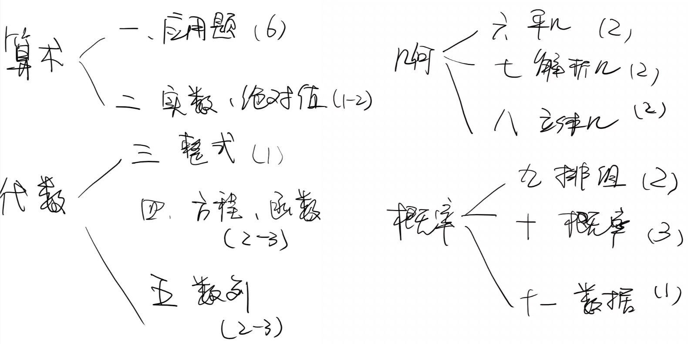

# MBA 考研笔记

## 提面

[管理学知识](https://github.com/daixwu/MBA/blob/master/notes/interview/MBA%E7%AE%A1%E7%90%86%E5%AD%A6%E7%9F%A5%E8%AF%86.md)

[提前面试常见问题及选择策略](https://github.com/daixwu/MBA/blob/master/notes/interview/%E6%8F%90%E5%89%8D%E9%9D%A2%E8%AF%95%E5%B8%B8%E8%A7%81%E9%97%AE%E9%A2%98%E5%8F%8A%E9%80%89%E6%8B%A9%E7%AD%96%E7%95%A5.md)

[英语面试](https://github.com/daixwu/MBA/blob/master/notes/interview/%E9%9D%A2%E8%AF%95%E8%8B%B1%E8%AF%AD.md)

## 英语

[考研英语二语法篇](https://github.com/daixwu/MBA/blob/master/notes/english/%E8%80%83%E7%A0%94%E8%8B%B1%E8%AF%AD%E4%BA%8C%E8%AF%AD%E6%B3%95%E7%AF%87.md)

[英语单词记忆](https://github.com/daixwu/MBA/blob/master/notes/english/%E8%8B%B1%E8%AF%AD%E5%8D%95%E8%AF%8D%E8%AE%B0%E5%BF%86.md)

[考研英语二阅读入门基本功](https://github.com/daixwu/MBA/blob/master/notes/english/%E8%8B%B1%E8%AF%AD%E9%98%85%E8%AF%BB%E6%8A%80%E5%B7%A7%E7%AF%87.md)

[阅读与写作词汇篇](https://github.com/daixwu/MBA/blob/master/notes/english/%E9%98%85%E8%AF%BB%E4%B8%8E%E5%86%99%E4%BD%9C%E8%AF%8D%E6%B1%87%E7%AF%87.md)

## 综合

### 数学

[实数、绝对值、平均值](https://github.com/daixwu/MBA/blob/master/notes/composite/algebra/%E5%AE%9E%E6%95%B0%E3%80%81%E7%BB%9D%E5%AF%B9%E5%80%BC%E3%80%81%E5%B9%B3%E5%9D%87%E5%80%BC.md)

[整式、分式](https://github.com/daixwu/MBA/blob/master/notes/composite/algebra/整式、分式.md)

[方程、不等式和函数](https://github.com/daixwu/MBA/blob/master/notes/composite/algebra/方程、不等式和函数.md)

[平面几何与立体几何](https://github.com/daixwu/MBA/blob/master/notes/composite/geometry/%E5%B9%B3%E9%9D%A2%E5%87%A0%E4%BD%95%E4%B8%8E%E7%AB%8B%E4%BD%93%E5%87%A0%E4%BD%95.md)

[联言 选言与推理考题](https://github.com/daixwu/MBA/blob/master/notes/composite/logic/%E8%81%94%E8%A8%80%E3%80%81%E9%80%89%E8%A8%80%E4%B8%8E%E6%8E%A8%E7%90%86%E8%80%83%E9%A2%98.md)

