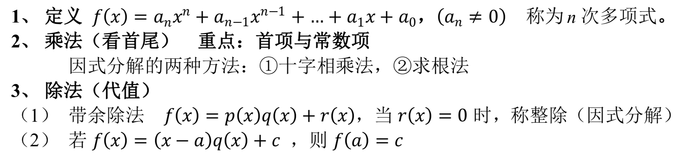
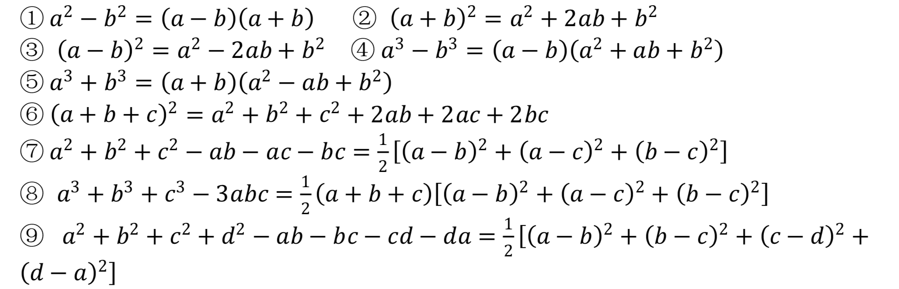
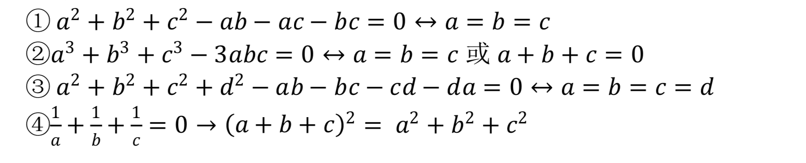
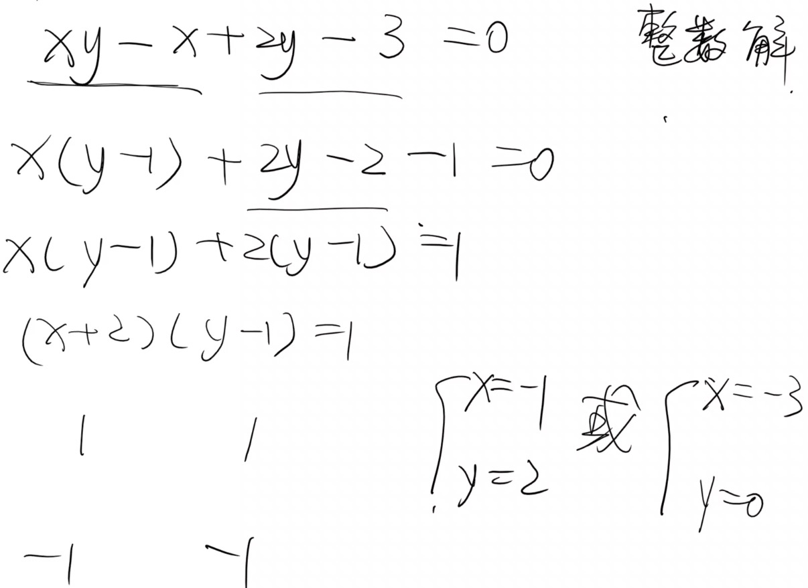
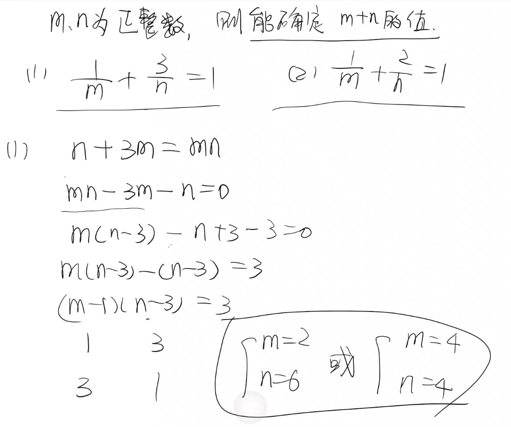
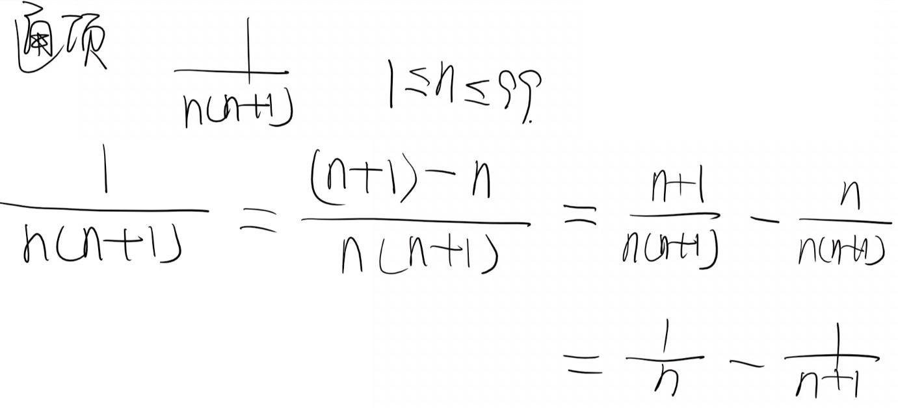
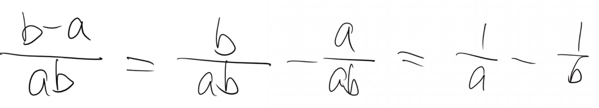
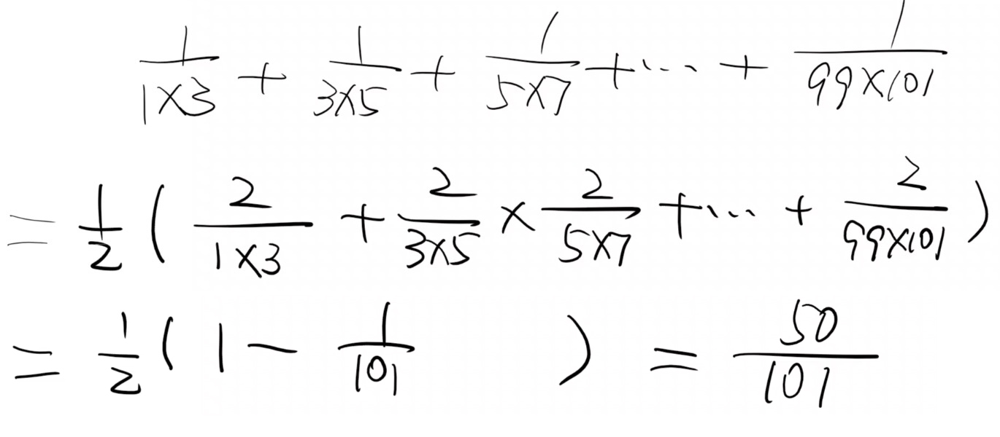
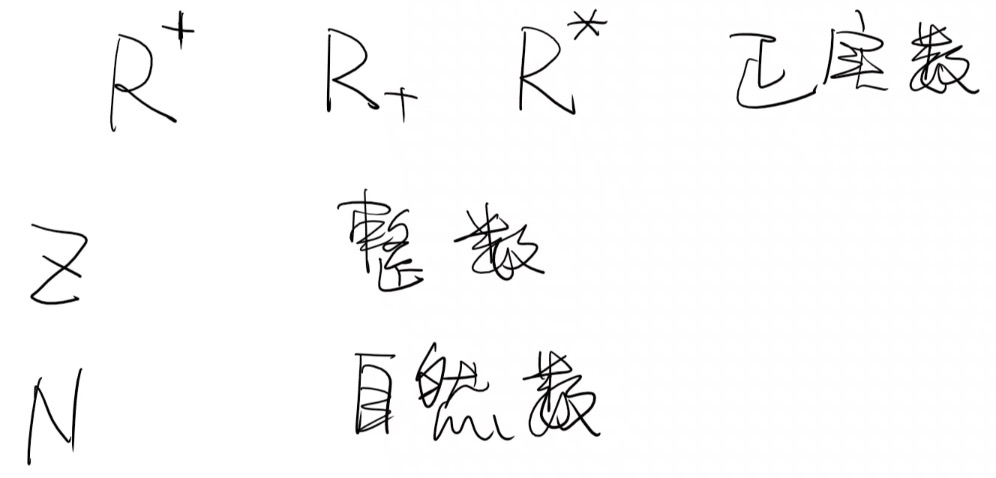

# 整式、分式

## 整式（多项式）

## 分式

## 因式分解的基本方法

### 运用公式法

#### 常用公式

#### 有用的结论

### 分组分解法

### 十字相乘法

## 因式定理

因式定理：当因式为 0 则整体为 0，即若 f(x)能被(x-a)整除，那么 f(a)=0

## 裂项公式

裂项基本原理：分子是分母两项之差

栗子：

## 集合

集合的概念：将能够确切指定的一些对象看成一个整体，这个整体就叫做集合，简称集。集合中的各个对象叫做这个集合的元素。

集合考点：互异性 集合中的元素没有重复

