# 方程、不等式和函数

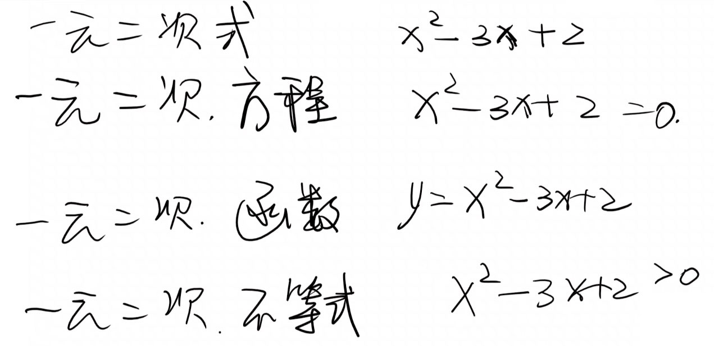

## 一元二次方程

只含有一个未知数，且未知数的最高次数是二次的方程，其一般形式为：ax²+bx+c=0(a≠0)

### 求根公式

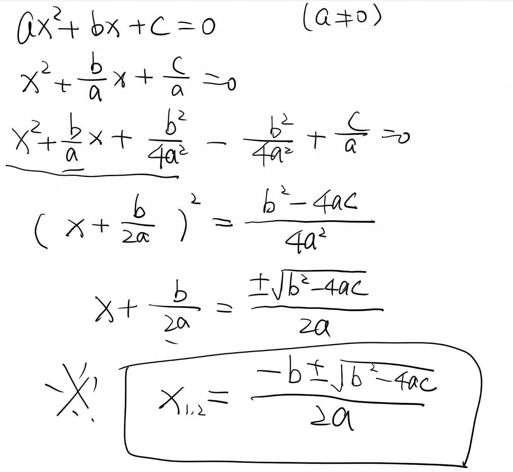

### 根的判别式

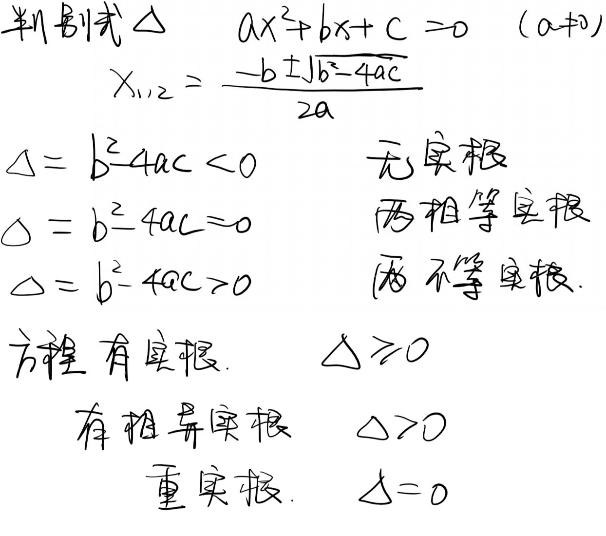

### 韦达定理

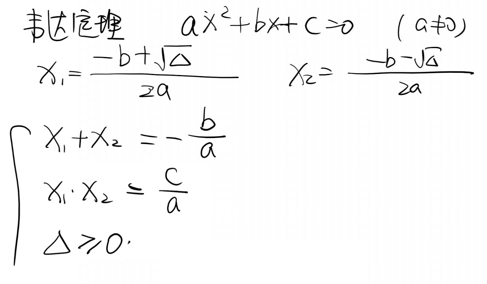

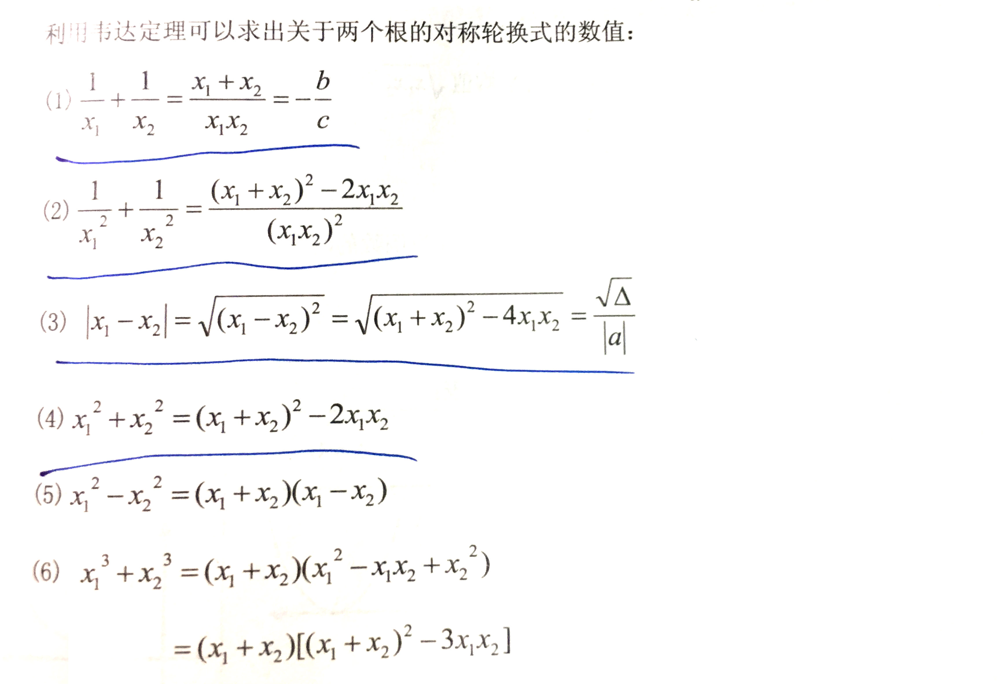

## 一元二次函数

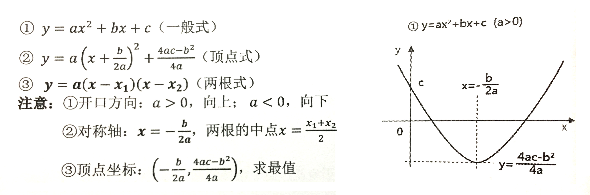

## 一元二次不等式

不等式求解：ax²+bx+c>0 (a>0)（大于零取两边，小于零取中间）

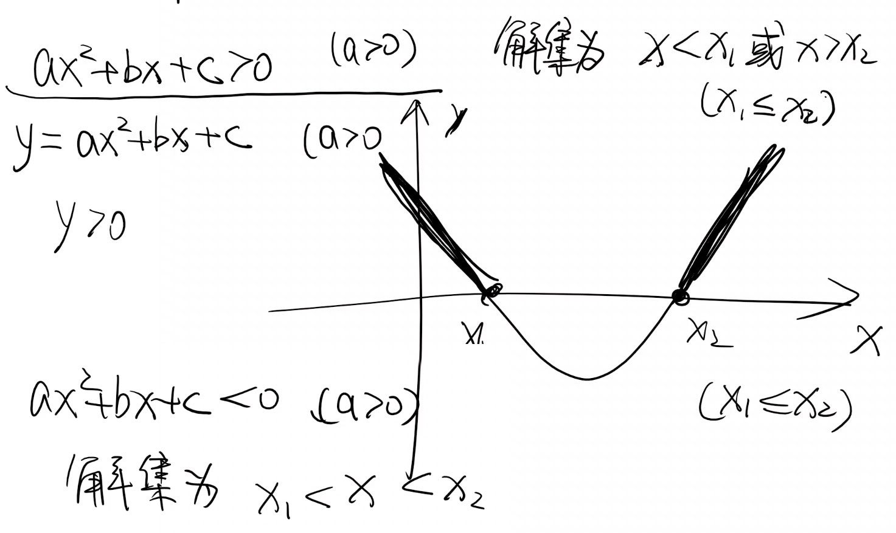

### 充分性判断题

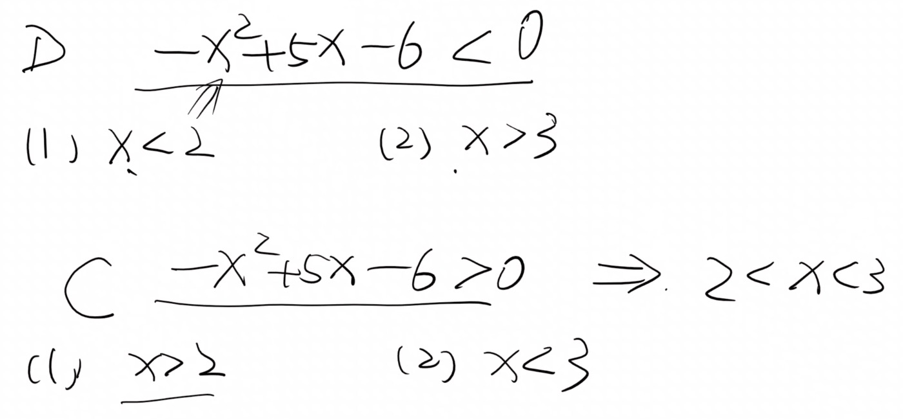

### 绝对值

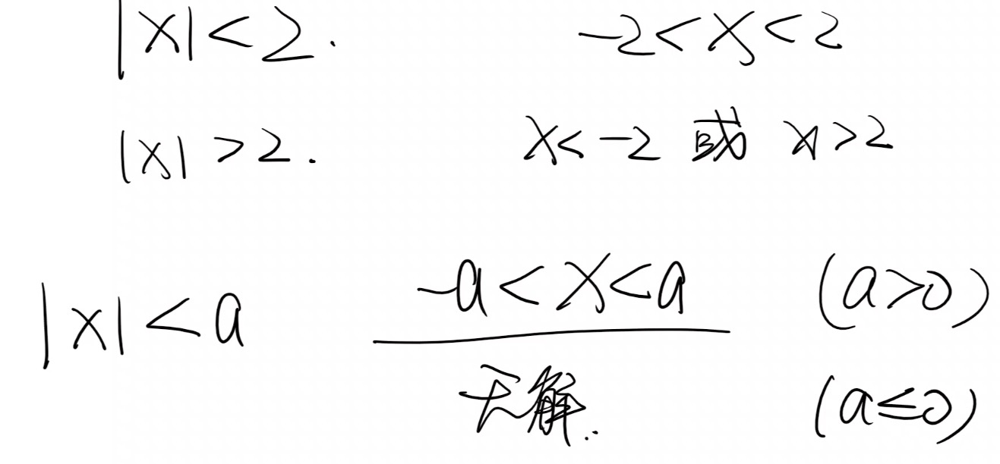

### 恒成立条件

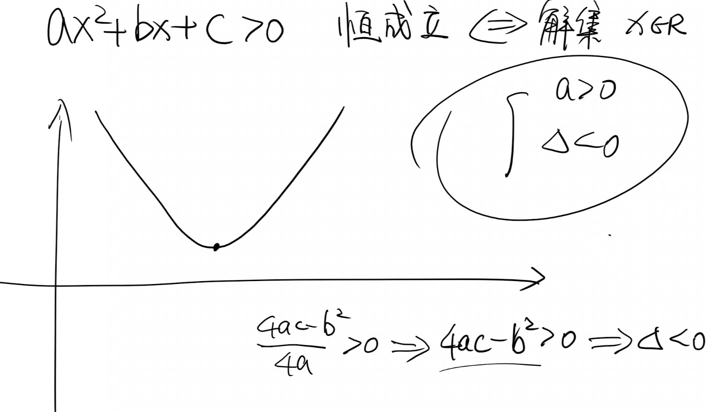

### 知解集推不等式

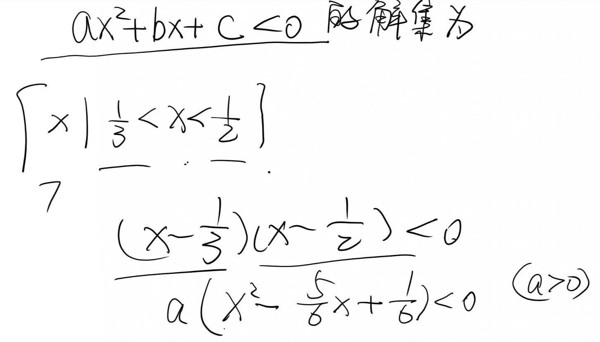

## 指数与对数

### 指数运算性质

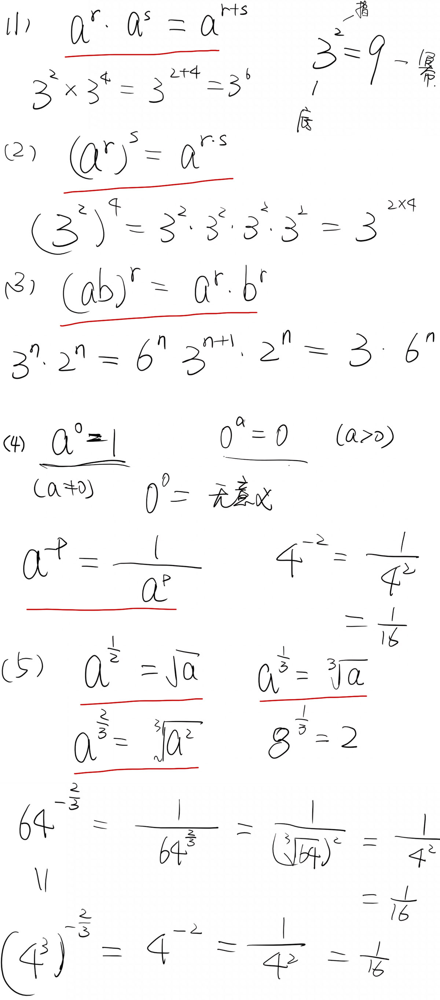

### 对数运算

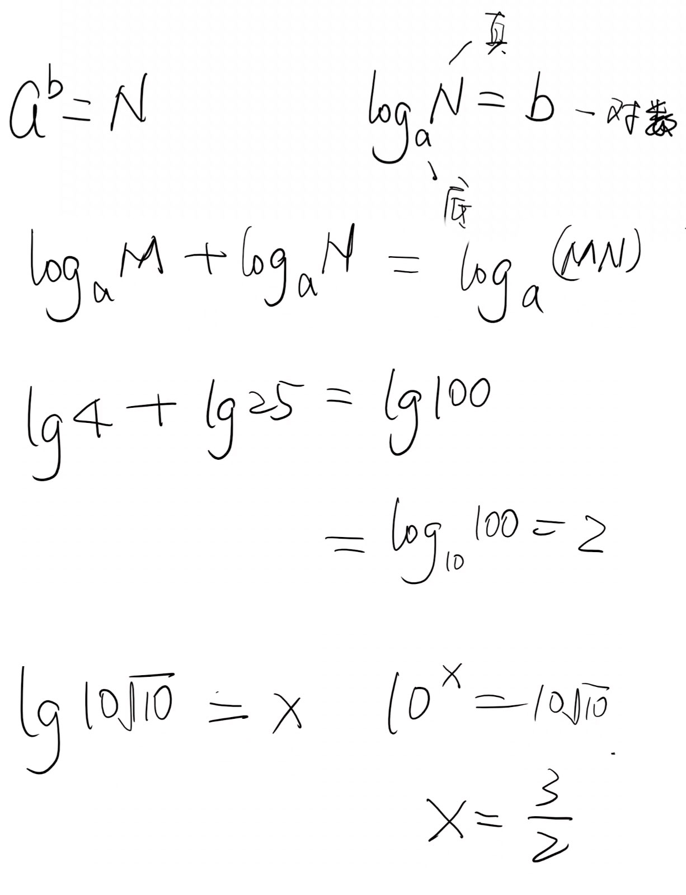
