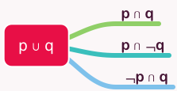
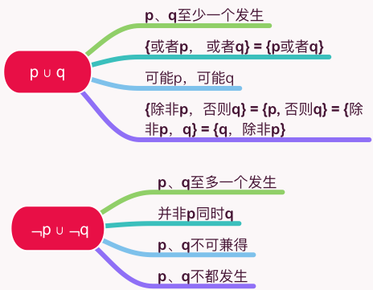

# 联言 选言与推理考题

## 1 基础命题

### 1.1 联言命题：断定几种事物情况同时存在的命题

只要断定p、q是**同时**发生的都可以简化为 p ∩ q

> 由所有属于集合p且属于集合q的元素组成的集合，叫做p,q的交集（读作p交q）。

逻辑考题中常见的为（转折关系）**p但是q**，也简化为p ∩ q

当然可以推广为 p ∩ q ∩ m ∩ ...

### 1.2 选言命题：断定几个可能的事物情况中至少有一个存在并且可以同时存在的命题

只要断定p、q是**至少一个**发生的都可以简化为 p ∪ q

显然p ∪ q包含了三种联言： ① p ∩ q ② p ∩ ﹁q ③ ﹁p ∩ q

逻辑考题中常见的有:

1. p、q至少一个发生
2. {或者p， 或者q} = {p或者q}
3. 可能p，可能q
4. {除非p，否则q} = {p, 否则q} = {除非p，q} = {q，除非p}

以上都可以简化为 p ∪ q

当然可以推广为 p ∪ q ∪ m ∪ ...

常考的还有：

1. p、q至多一个发生
2. 并非p同时q
3. p、q不可兼得
4. p、q不都发生

注意简化为：﹁p ∪ ﹁q

系统逻辑 第一章  55分

