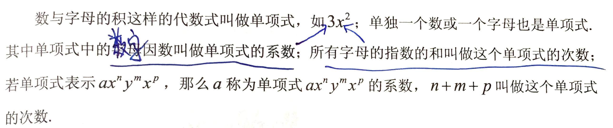
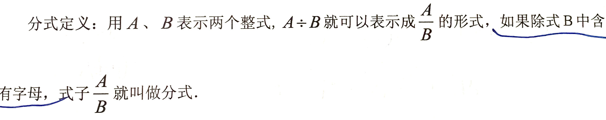
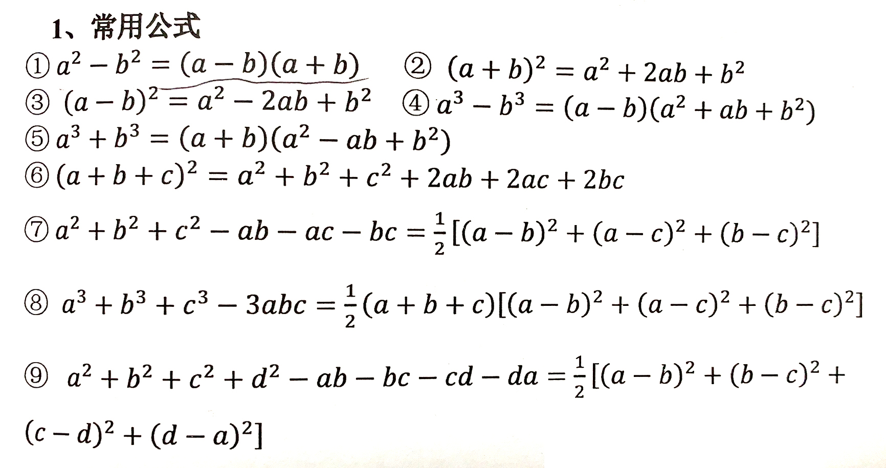
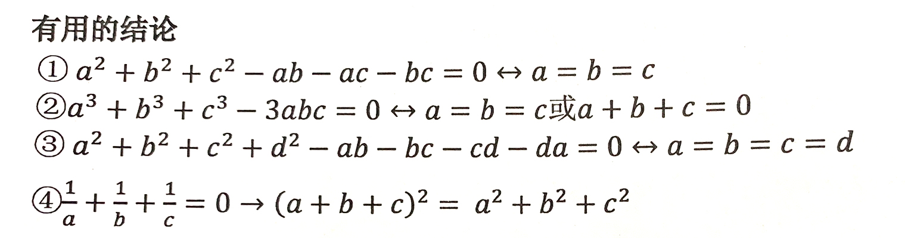
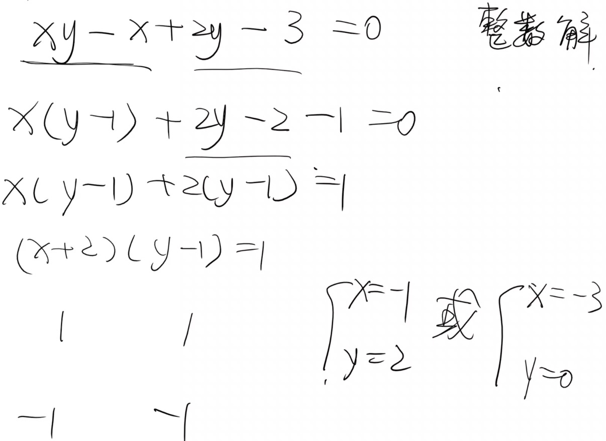
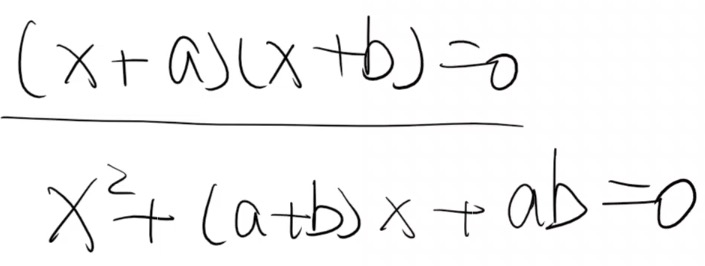
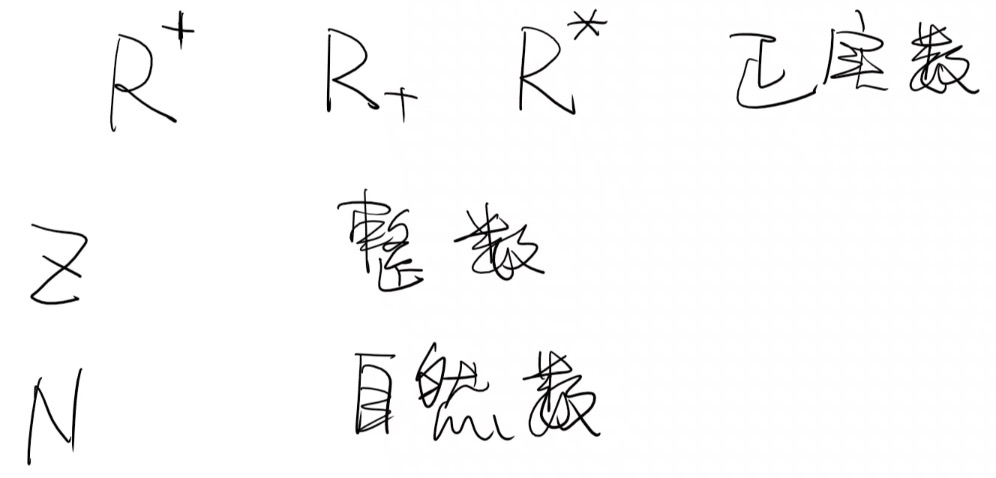

# 整式、分式

## 单项式

## 多项式

几个单项式的和叫做多项式，在多项式中，每个单项式叫做多项式的项，其中不含字母的项叫做常数项。

## 整式

单项式和多项式统称为整式

## 分式

## 因式分解的基本方法

### 运用公式法

### 分组分解法

### 十字相乘法

## 集合

集合的概念：将能够确切指定的一些对象看成一个整体，这个整体就叫做集合，简称集。集合中的各个对象叫做这个集合的元素。

集合考点：互异性 集合中的元素没有重复

