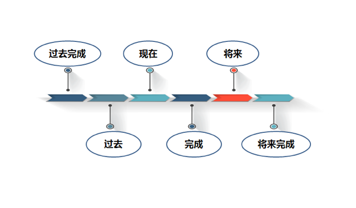
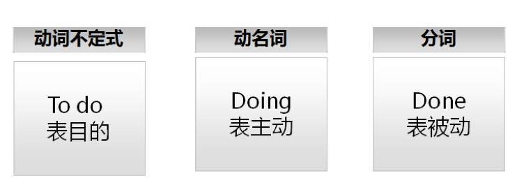

# 考研英语二语法篇

## 语法知识考点归纳

### 1、名词、代词的数和**格的构成及其用法**

所属格 `'s`, `my`, `your`, `his`, `her` , `its`

> My 形容词物主代词 / mine 名词 = my sth

**`Of` 短语用法**：

My book

Book of me

A of b  b 的a

A of b of c  c的b的a

Special responsibilities of the news media 新闻媒体的特殊责任

A kind of  new source 一种新的资源

A lot of books 大量的书

### 2、动词**时态、语态**的构成及其用法

过去，现在，完成，将来

do → did, do/ does/ doing, has/ have done , be going to do / will do/ be to do

### 3、**形容词与副词的比较级和最高级的构成及其用法**

Worse / bad / worst

**As...as... 和...一样**：

As soon as possible

A is as fast as B.

a is not as fast as b

**Not as...as... / not so...as... 和...不同**：

Society develops not so much through  talents（人才） as by tools.

社会与其说是通过人发展起来的不如说是通过工具发展起来的

> Not so much ...as...  与其说...不如说...

He is not so much angry as disappointed.

与其说他生气了不如说他很失望

### 4、常用连接词的词义及其用法

4 kids take part in it.

There are 4 kids and they take part in it.

There are 4 kids taking part in it.

There are 4 kids who take part in it.

**常用连接词**：

承接递进：and, both and, not only...but also, even(即使), indeed(确实），furthermore(此外，相当于secondly)

转折：but, however, in fact, instead, rather than (而不是）(earlier , previous先前的）

因果：because, so / therefore 因此 / for 因为 / as , since 因为

### 5、**非谓语动词（不定式，动名词，分词）的构成及其用法**

To do , doing, doing/ done

### 6、虚拟语气的构成及其用法

判断真假

Should have done / would have done 本应该，本可能做，而并没有

Without要不是 your words, we would have gotten into great trouble.

要不是你的话我们就陷入大麻烦之中了

### 7、各类从句（定语从句、主语从句、表语从句等）及强调句型的结构及其用法 

定语从句 eg： Here comes a girl / who is so beautiful.

### 8、强调句、倒装句、插入语的结构及其用法

强调句 It is...that...

It is (in the morning) that i do some cleanings.

I do some cleanings  in the morning.

倒装句：

Here comes a girl.

A girl comes here.

插入语：

He , **i think**, is handsome.

According to...

The average 普通 supermarket ，**according the Food Marketing Institute** 食品营销机构，carries 44000 items 物品.

Obama, the previous president同位语, is smart 明智的.

## 英语句子的两种方式

主谓宾：A.什么做了什么？(Who did what?)   Bird sings. / I like music.

主系表：B.什么是什么？(Something / sb is what?)   I am a teacher. 

>简单句=主语+ 谓语+（宾语）

The sun rises.

We raise a kid.

A kid is raised by us.

Eg: The visitors are/go up to 781.1 million 一百万.

## 简单句成分构成

| 名称 | 定义                   | 词性        |
| ---: | ---------------------- | ----------- |
| 主语 | 主体对象               | 名词        |
| 谓语 | 主语的动作行为或状态   | 动词/系动词 |
| 宾语 | 主体动作涉及到的对象   | 名词        |
| 定语 | 修饰名词               | 形容词      |
| 状语 | 修饰，大多修饰谓语动词 | 副词        |

## 句子的成分变化

### a.主语（名词，名词性结构或者名词性从句）

**A horse** runs much faster.

**We** wish him success.

**To drink a cup of water** is great.

**Swimming alone in the river** is very dangerous.

**What we can’t get** seems better than what we have.

What / how / when + ?

It is right / that we should study hard.

### b.谓语（动词及动词的变化形式）

The little child **cries**. (现在时)
He **has caught** a bad cold.  （完成时）
I **am playing** basketball. （进行时）
I **may be** late.  （情态v+v原形）
The work **is finished** by our team.  （被动语态）

Eg: Taking a gap year间隔年，休学年 to figure things out initially / can help prevent stress 免于压力 and save money later on.

Help sb do sth

It can help do sth.

#### 谓语动词的分类

* 实意动词：do/ did/ does

* 系表动词

  * be： am, is, are, been, being 

  * 变得：get, become better, turn, go, grow

  * 感官：smell, taste, look, feel, sound good

  * 保持：Keep fresh， remain, seem, appear, prove

* 情态动词 + do, (can do/ must do/ could do/ should do)

Been / have been done

The apple has been eaten by him!

Being

The apple is being eaten at that moment I come in.

#### 谓语动词的时态

Will have done

By the end of this month, we will have learned all words. 截至到...时间点

Eg: Between 1890 and 1920, however, relational feminism女权主义（女权关系论）/ female, which **had been** the (domain域名)dominant主导 strain in feminist thought and which still **predominates** 先导 among European and non-Western feminists, **lost** ground(地，操场，优势) in England and the United States.

#### 谓语动词的语态（主动还是被动）

Sb does/ did / do sth.

Sth be done by sb.

eg: I have finished the homework.
The homework has been finished by me.

---

be interested in

eg: I am interested in this word.

be exposed to

eg: I am exposed to new words. (接触，面临）
接触到新的单词

be concerned about （考虑，担心）

eg: I am concerned about scores.

be dressed in

eg: I am dressed in a pink coat.

be qualified for

eg: I am qualified for teaching. (quality 品质，素质， qualify) 有资格，胜任

be based upon

eg: Theory 理论 is based upon practice 实践.

---

Eg: the number of museums increased to 4697.

#### 非谓语动词

Developing （发展中） / developed （发达） countries

> V + ing / ed  => adj.

Falling (正在落) / fallen （落在地上） leave(叶子）

determined person 有决心的，果断的

1. **Making friends is** extremely important to teenagers.

2. But with homework **counting for no more than 10% of their grades** 分数 后置定语, students can easily skip 跳跃，忽略（ignore) half of their homework.

3. **To promote this idea** 目的状语, he turned to the university-admissions process.

## 长难句=简单句+并列句+从句+特殊结构

### 为什么有长难句

1. 英语的名词要修饰
2. 英语多被动结构
3. 英语更重视结构
4. 句子多，需要连接

### 并列句连词

并列顺接连词 and, both…and…, not only…but also

转折连词 but, while ,yet, whereas

因果连词 for, so  / as because, since, as

选择连词 or, either…or （或A或B），neither…nor （既不是A也不是B）

Love is a touch and yet （但是） not a touch.

Not yet 还没 / , yet 但是

### 并列句的省略

A and B / A and B but C / A , B and C

Eg: Many first-generation students “struggle to努力 navigate导航 the middle-class culture of higher education, learn了解 the ‘rules of the game’, and take advantage of利用 colleges resources".

### 从句

#### 定语从句（形容词）

> 定语从句：引导词常见有that, which, who, when, where, 放在名词之后，用来修饰名词。

There is a beautiful girl.

There is a girl **who is beautiful**.

Eg: Food prices, which rose by about 11%, have made a big contribution.

> rose / rise by 上升了 / rise to 上升到

Who/ that /whom / whose / which 引导代词

When / why / how / where 引导副词

I still remember the day / when you left.

Furthermore, humans have the ability to modify the environment / in which / where  they live.

Change / better modify 改善，改良，改动

---

In which = where

On which = when

For which = why

Of which = whose

---

#### 名词性从句（名词）

> 名词性从句：无论哪种形式，都不影响句子理解，按照正常顺序即可。

**That the seas are being overfished** has been known for years.

It has been known for years / that the seas are being overfished.

> It is...that...

This special report said / that the biggest problem at the moment is not a lack of demand but a lack of good work 作品 to sell.

> Not ... but... 不是而是 Not only... but...

The difference is  / that   there are still buyers in the market.

The news  / that Tom would go abroad / is told by him. 同位语从句

News / idea / fact / concept (概念）/ belief （信念，信仰） that... 这些抽象词后接同位语从句

The news / that he told me / is that Tome would go abroad. 定于从句

Tell sb sth

#### 状语从句（副词）---九大状语从句

> 三大从句：看到引导词先断开，理解主句，再理解从句，必要时候舍弃从句也不是不行。

| 种类  |  常用连接词 | 特殊连接词 |
| --------: | ----------------- | ---------------- |
| 时间状从 | When, as, while, before, after, since, till, as soon as | The moment, the instant, the minute, the second |
| 地点状从 | where  | anywhere, everywhere |
| 原因状从 | Because, as, for, since  | Seeing that, considering that, now that, given that, in that |
| 结果状从 | So…that, such…that | To the degree that, to such a degree that |
| 目的状从 | So that, in order that | in case, in the hope that, for the purpose that |
| 条件状从 | If, unless | Suppose, providing, provided, on condition that, as/ so long as |
| 让步状从 | Although, though, even if | While, as |
| 比较状从 | As, than | The more…the more…   /  just as…so…/No more than/not so much as |
| 方式状从 | As , as if, as though |

> Since+ 时间，表示自从，用完成时态,其他都表示“因为”

### 特殊句式=倒装+强调+虚拟+否定

#### 倒装 / 主谓 谓主

Before 1066, in the land (we now call Great Britain) lived peoples (belonging to two major language groups).

Before 1066, peoples (belonging to two major language groups) lived in the land (we now call Great Britain) . 

Along with the many folks looking to make a permanent home in the United States came those / who had no intention to stay, and 7 million people arrived while about 2 million departed离开(leave).

**Those** folks (居民people) (who had no intention to stay定语从句) **came** along with the many folks (looking to make a permanent(永久的，恒定的) home in the United States).

不及物动词 倒装

完全倒装，不完全（部分）倒装

Only in this way can we embrace a better tomorrow.

We can embrace a better tomorrow only in this way.

Nowhere do 1980 census普查 statistics dramatize/ show  the American search for spacious living than in the Far West.

1980 census普查 statistics dramatize nowhere more the American search for spacious living(宽敞舒适的地方) than in the Far West.

#### 强调句---It is …. that…

正是...才...

We hear the more honest argument only in recent years.

It is only in recent years that we hear the more honest argument.

It is we(us) that hear the more honest argument only in recent years.

It is the more honest argument   that we hear only in recent years.

It is worrisome 令人担心的 / that society are medicalizing more behaviors. 药物化一些行为

#### 虚拟语气---情态动词+have done

Should/ would/ can/ must have done

He was one of 3. If he **had played** last season, however, he **would have been** one of 42.

#### 否定结构

All / both / every + not = 不完全否定，并不是所有都不.../ 并不是两者都不...

Not everyone will agree with it.
Everyone will not agree with it.

并不是所有人都...

否定转移

Not…because: people don’t cry because they are sad.

People cry not because they are sad.

think/imagine / believe +从句：

I don’t think he is right.

I don’t teach because teaching is so easy.

## 总结

1. 长难句主干最重要，修饰成分其次，结构和意思都可以相对带过。
2. Which, what, when 等一看就是从句，that 85%是从句。 that / this / it / those/ such
3. 特殊句式少见，掌握规律，强调必考。
4. 句子里面动词最重要，简单句只能一个动词，长句子有几个动词有几件事。
5. 大多数语法知识点的考察就集中在后置定语，包括定语从句，非谓语的运用。 修饰某一名词！

## 长难句断开可通过标点 / 连接词 / 引导词/ 动词

