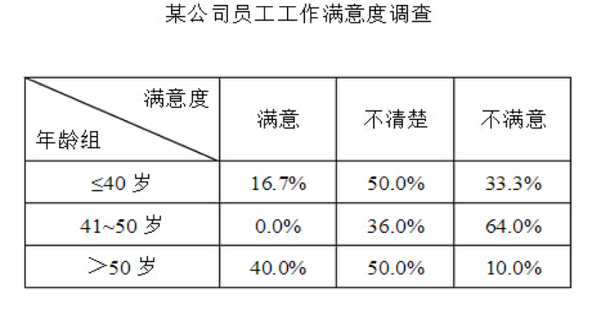
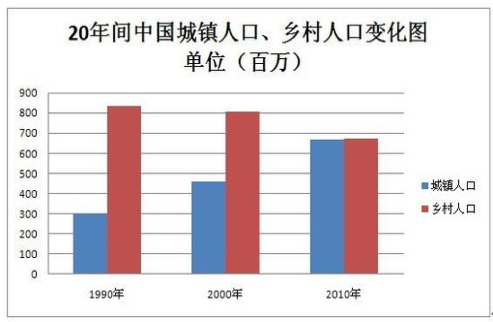

# 英语写作篇——大作文

| 类别 | 词数 | 时长 | 分值 | 平均分 |
| --- | --- | --- | --- | --- |
| 图表作文 | 160 | 35~40min | 15分 | 9分 |

## 类型

| 统称 | figure, graph, chart |
| -- | -- |
| 表格 | table |
| 饼状图 | pie chart |
| 曲线图 | line chart |
| 柱状图 | bar chart |

## 写作的大体框架（三段式）

1 图标分析 4~5句 6分（数据不能简单罗列，需做归纳总结-趋势，极值）

2 原因分析 4~4句 7分

3 得出结论 2分（政府，社会，经济，个人，科技）

3.1 好的是预测趋势，继续保持

3.2 不好的，要解决问题，引起重视

### 第一段模板句 + 图表中文 2分

1、 As is shown in the chart,we can see that + 主题词

2、 The statistics about + 主题词 are precisely illustrated by the chart.

eg. The statistics about **population changes over 20 years** are precisely illustrated by the chart.

3、 The chart shows / illustrates / depicts/ reveals that... 表明

eg. The chart shows that population has changed over 20 years.

4、 As is shown / demonstrated / exhibited in the chart that... 如图所示

eg. AS is shown in the chart that, we can see that population has changed over 20 years.

5、 As can be seen from the chart, ... 如图所示

6、 From the chart, we can see clearly that ...

eg. From the chart, we can see clearly that population has changed over 20 years.

eg. As is shown clearly in the table, there was a noticeable change in the way people spent their holidays from 2000 to 2009.

| 词汇 | 词义 |
| -- | -- |
| statistics / data  | 数据 |
| precisely | 精准的 |
| illustrated | 描述，体现 |
| depicts | 体现, 表明 |
| reveals | 体现，表明 |
| shown | 解释，表明 |
| demonstrated | 演示，表明 |
| exhibited | 表现，表明 |
| noticeable | 明显的 |

### 第二段第一句 原因起头句 2分

1、The phenomenon / change … mainly results / arises / stems / originate from several factors. 上述现象源于以下因素

2、There are many causes(因素) / reasons(原因)  for the dramatic growth / decrease.

3、A number of factors can account for(解释) the change.

4、The reasons can be listed as follows. 原因列举如下

5、Several factors as follows contribute to (导致) the above phenomenon. 如下几个因素造成了上述现象

6、The causes for above situation are varied.

7、The reasons for this are not far to seek.

8、There are many reasons responsible for (负责解释) this.

9、Above phenomenon can be attributed to several factors. 上述现象可以被归因于几个因素

| 词汇 | 词义 |
| -- | -- |
| phenomenon  | 现象 |
| change | 变化 |
| arises | 源于 |
| stems | 源于 |
| originate | 源于 |
| factors | 因素 |
| dramatic | 剧烈的 |
| account for / explain | 解释 |
| contribute to | 导致 |
| causes | 因素 |
| situation | 情况 |
| varied | 多样的 |
| seek，sought / look for | 寻找 |
| attribute a to b | 把a归因于b（b是a的原因）|

### 第二段落的原因陈述点表达

| 第一 | 第二 | 第三 |
| -- | -- | -- |
| Firstly | Secondly | Thirdly |
| To begin with | Furthermore | Last but not least |
| Initially(最初的) | Additionally(其次) | Finally(最后) |
| To start with | What’s more | Lastly |

| 一方面 | 另一方面 |
| -- | -- |
| On one hand | On the other hand |
| For one thing | For another |

### 第三段 2分

**Taking all these factors into account, we can believe this phenomenon is quite normal and predict that the present situation will continue for quite a while in the forthcoming(未来的) years**. And if this trend can be kept and guided(引导) properly(适当的), our life as well as our society will be made better.

## 大作文写作的具体内容

### 第一段---数据的描述和分析

#### a.趋势及数据描述必备词及句法

1、**上升，增加**

As is shown in the line chart, the number of museums and visitors increased from 2013 to 2015.

There is a line chart showing the increase in the number of museums and visitors from 2013 to 2015.

| 词汇 | 使用 |
| -- | -- |
| increase数量 = grow / rise | The number of people increase / Population increase |
| increase 趋势 = climb up / rocket / shoot up  | This line shows a trend of climbing up |

2、**下降，减少**
We can see clearly the number of population in rural areas(乡村地区) decreased during 20 years from the chart.

In the chart, the number of population in rural areas showed a trend in declining during 20 years.

| 词汇 | 使用 |
| -- | -- |
| decrease 数量 = reduce / drop | The number reduces / drops 数量减少 |
| decrease 趋势 = decline / fall down / sink down | This line chart shows a trend of declining / sinking down. |

3、**所占百分比**

| 词汇 | 词义 | 使用 |
| -- | -- | -- |
| make up / take up / account for | 占比 | Costs on gifts account for 40% during the Spring Festival |
| occupy | 占据 | Costs on gifts occupy 40% in the Spring Festival |

---

4、**波动（有升有降）---趋势（一般曲线图变化）了解**

| 词汇 | 词义 | 使用 |
| -- | -- | -- |
| fluctuate / rebound 回弹 / wave / go ups and downs | 波动 | It shows us that lines in the chart kept fluctuating all the time and two reached the same in the year of ... |

5、**增加到 / 了，减少到 / 了 了解**

| 词汇 | 词义 |
| -- | -- |
| increase to / by | 增加到 / 了 |
| decrease to / by | 减少到 / 了 |
| reach to |  达到 |

6、**表示变化程度 了解**

| 词汇 | 词义 |
| -- | -- |
| quickly / rapidly / dramatically / sharply / significantly | 快速地 |
| gradually / moderately / slowly / slightly | 缓慢地 |
| stay / keep / remain / maintain + steady / unchanged/ stable | 稳定的，保持不变 |
| almost， nearly, about, around | 几乎，差不多，左右 |
| respectively | 分别，各自 |
| precisely, exactly | 精准地，正好 |

7、**最值 / 极值 了解**

| 词汇 | 词义 |
| -- | -- |
| peak at / reach to its highest point at | 高点 |
| bottom at / reach to its lowest point at | 低点 |

In 2015, the number of visitors peaked at 781100 thousand / 781.1 million.
2015年，参观人数达到了最大值， 7811（十万 100 thousand）人次。

8、**倍数  times / 2 times, double / three times, triple 了解**

A + be+ 倍数+ as much as +B

A is two times as much as B.

A + be+ 倍数+ the amount +B

A is two times the amount B.

A + be+ 倍数+ what it was +B

Divorce rate in China in 1996 was almost 17 times as much as that (divorce rate) in 1956.

9、**比较级(less than / more than) 了解**

In managerial position, the number of the male is obviously more than that of the female.

10、**时间介词 了解**

on Sunday, on the Spring Festival, on my birthday

In the Spring Festival 一段时间内

in January, in 2014, in the 21st century

from 2000 to 2012 / during 12 years/ over 12 years

during the period of 12 years to 2012

11、**多样化表达 了解**

34% = over one third

50%= a half

#### b.不能简单的把每一个数据罗列出来，需要具备归纳概括性

| 类型 | 备注 |
| -- | -- |
| 柱状图 | 留意差别较大的同类数据，对不同类型的数据进行分析、归类 |
| 饼状图 | 描述份额和所占比的对比，凸出明显值 |
| 曲线图 | 描述趋势和极值对比，如果多条曲线有交叉点，需要说明 |
| 表格 | 横向纵向比较，挑选最具代表性的以及相差最悬殊的数据进行分析对 |
| 动态图 | 曲线图，部分柱状图，要有变化趋势的描述 |
| 静态图 | 饼状图，部分表格 |

1、**表格描述（就某一个方面对比，选出最代表的数值）**

As is clearly shown in the table, people’s job satisfaction degree(工作满意度) varies from person to person. According to the data given in the table, we can see that the percentage of people dissatisfied with their jobs is about 64% among those people between 41 and 50. As for those under 40, the figure is 33%. In comparison, it is the lowest among those over 50, about 10%.

The above table clearly shows us the statistics of employment satisfaction(工作满意度) in a certain(某个) company. Most of people under 40 are unclear with their work; 64% of those between 40 and 50 are not satisfied with their job; while 40% of people over the age of 50 feel content(满意) with their work, and compared with the other two groups, their satisfaction level is highest.

2、**饼状图的描述（每一部分百分比都提到）**

characteristic / feature 特色，特点

As we can see, The (pie) chart shows the percentage of factors customers concerned(关注的) when they chose restaurants in one city in 2017.

The spending on characteristics ranks first, accounting for 36.3% of the total. The next significant expending items are service, environment,  price and other factors, which are 26.8% , 24.2%, 8% and 4.7% respectively.

3、**柱状图的描述（趋势，最大值最小值）**

The bar chart above clearly reflects / shows(体现，反映) the changes in the data between urban and rural population in China during the past two decades.

For urban people / residents(城镇居民), there was a noticeable(明显) jump, (the number increased sharply) from 300 million to 660 million between 1990 and 2010 (during 20 years). By contrast(对比而言）, a remarkable(显著地) decline occurred in the number of rural population during the same period （the number of rural population decreased remarkably). It's obvious that （ we can see that ) in 2010, two bars almost kept at the same line.

As is shown in the bar chart, we can see changes in statistics on choices of graduates between 2013 and 2018.

Most graduates chose to work, but the number decreased gradually(逐渐地). The number of graduates receiving further study increased a lot. While, the increasing number of graduates who started their own businesses still accounted for a small part, to 2.6%.

