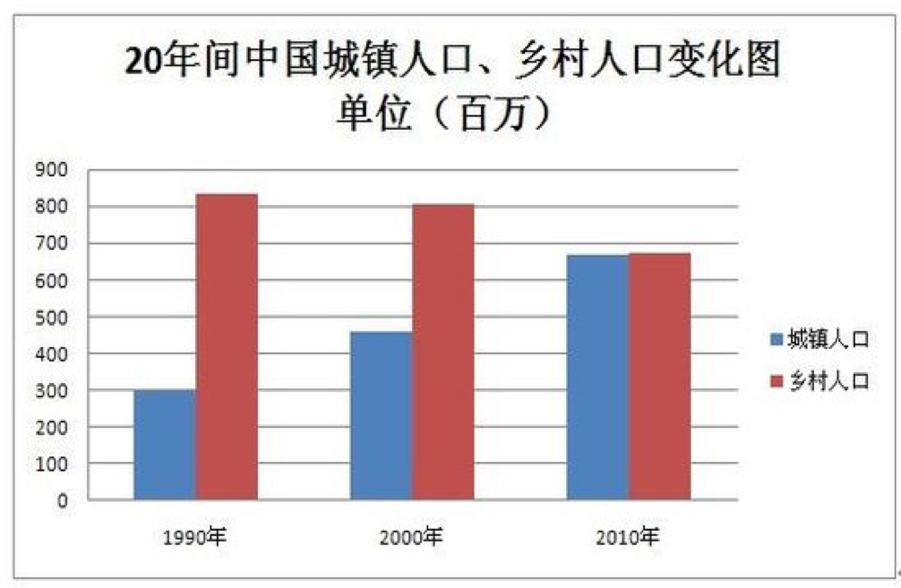
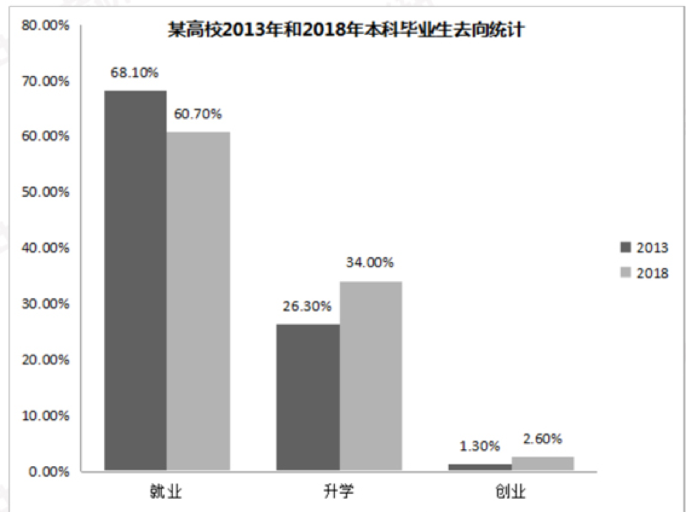

# 英语大作文模板笔记

## 第一段

1 As is shown in the chart ( line chart, bar chart 曲线和柱状图), we can see that a noticeable change in ___中文。 A increased / declined over xx years (from xxx to xxx) , and it reached to + 数值 （最高值） in the year of ___.  (B increased / declined over xx years (from xxx to xxx) , and it reached to + 数值 （最高值） in the year of ___.)

As is shown in the bar chart, we can see that a noticeable change in the data between urban and rural population in China during the past two decades. The urban people increased from 1990 to 2010，and it reached to 660 million in the year of 2010. By contrast, the number of rural population decreased remarkably. We can see that in 2010, two bars almost kept at the same line.

The bar chart above clearly reflects / shows(体现，反映) the changes in the data between urban and rural population in China during the past two decades.

For urban people / residents(城镇居民), there was a noticeable(明显) jump, (the number increased sharply) from 300 million to 660 million between 1990 and 2010 (during 20 years). By contrast(对比而言）, a remarkable(显著地) decline occurred in the number of rural population during the same period （the number of rural population decreased remarkably). It's obvious that （ we can see that ) in 2010, two bars almost kept at the same line.

As is shown in the bar chart, we can see that a noticeable change in statistics on choices of graduates between 2013 and 2018.Most graduates chose to work, but the number decreased gradually. The number of graduates receiving further study increased a lot. While, the increasing number of graduates who started their own businesses still accounted for a small part, to 2.6%.

2 As is shown in the pie chart（饼状图）, we can see different percentages（比例） of ___中文。In the chart, A takes up a lion’s share（占比最高）, accounting for xx% of the total. The next (two / three) items are..., which are x% and x% respectively.

As is shown in the pie chart, we can see different percentage of factors customers concerned when they chose restaurants in one city in 2017. In the chart, the features takes up a lion’s share, accounting for 36.3% of the total. The next four items are service, environment,  price and other factors, which are 26.8% , 24.2%, 8% and 4.7% respectively.

3 As is shown in the table 表格, we can see that___ 中文。纵轴 1，2，3 对应横轴同一组数据分析。

As is shown in the table, we can see a survey on job satisfactory of employees in a company. In this survey, half of employees under 40 are unclear to their jobs. While, 64% of them between 41and 50 are dissatisfied  with jobs. At last, almost half of them over 50 feel satisfied with their jobs.

## 第二段

There are several factors responsible for above phenomenon. Initially. Additionally. Eventually. Firstly Secondly Thirdly

To start with  What’s more Lastly

原因：政府，社会，经济，个人，科技 （任选2-3点）

### 1 政府

**There is no doubt that（毫无疑问） this phenomenon has much to do with（与...密切相关） the policies that our government has adopted（采取，采纳）** to speed up China’s urbanization (城镇化发展) / encourage development of private-enterprises（私营企业 state-owned enterprise 国有企业）/ effectively protect environment around us（有效保护了我们周边的环境）

### 2 社会

With help of our society, more and more / increasing number of relevant（相关的）（related) facilities and resources are available（可利用，可获得）, such as museums.

With the rapid（快速的 ）development of our society, more have realized that it is very important for them to get social experience, which requires them of more part-time jobs.

ask sb to do sth / require sb of sth 要求某人做某事

### 3 经济

With the policy of reform and opening up（改革开发）, our living standard has been greatly improved, therefore we can afford sth（随着改革开放，人们生活水平提高，能买得起...）

afford sth 买得起 / afford cars / afford houses

With the rapid development of our economy, there is an increasing demand for a high-quality life, so we prefer more spiritual life than material one.
随着经济发展，人们的高品质生活需求越来越高，相比物质基础来说，更追求精神生活。

### 4 个人

With the steady /stable （稳定的）improvement of people’s living standard, the public care more about spiritual life, so more choose to visit museums.（随着生活水平提高，大众开始更多的关注精神需求）

people / visitor / tourist

The growing public appetite（胃口，食欲）for culture has greatly boosted（促进） the xxx business.
不断增长的大众文化需求极大地促进了xxx 产业的发展

The rising awareness（意识）of xxx (environmental-protection) in public brings great changes to above phenomenon. ( 大众xxx意识的提高给上述现象带来了巨大变化。)

### 5 科技

The rise of xxx (local car-business), mainly due to ( because of ) development of technology, is of little surprise, which not only free them from potential risks, but also bring them long-term benefits（利益）
由于科技带来xxx的发展，并不令人惊奇。xxx的发展不仅解决了当前潜在的危机，还给他们带来了长远的利益

## 第三段

Taking all these factors into account, we can believe this phenomenon is quite normal（正常的） and predict that the present situation（当前状况 ）will continue for quite a while in the forthcoming years.
