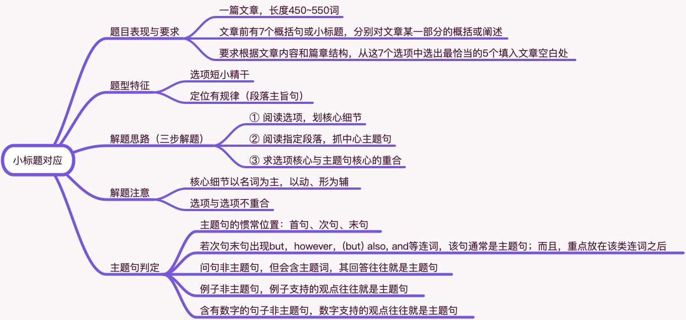

# 阅读新题型之小标题对应

大概率考

## 题目表现与要求

1 一篇文章，长度450~550词

2 文章前有7个概括句或小标题，分别对文章某一部分的概括或阐述

3 要求根据文章内容和篇章结构，从这7个选项中选出最恰当的5个填入文章空白处

## 题型特征

1 选项短小精干

2 定位有规律（段落主旨句）

## 解题思路（三步解题）

1 阅读选项，划核心细节

2 阅读指定段落，抓中心主题句

3 求选项核心与主题句核心的重合

## 解题注意

1 核心细节以名词为主，以动、形为辅

2 选项与选项不重合

## 主题句判定

1 主题句的惯常位置：首句、次句、末句

2 若次句末句出现but，however，(but) also, and等连词，该句通常是主题句；而且，重点放在该类连词之后

3 问句非主题句，但会含主题词，其回答往往就是主题句

4 例子非主题句，例子支持的观点往往就是主题句

5 含有数字的句子非主题句，数字支持的观点往往就是主题句
