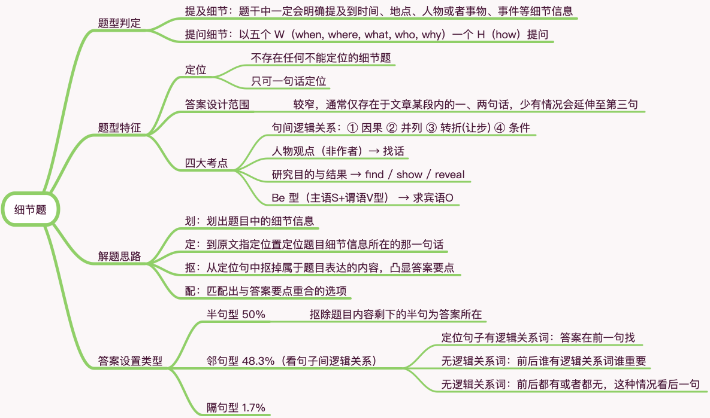

# 阅读题型归类之一 细节题

## 题型判断

1 提及细节：题干中一定会明确提及到时间、地点、人物或者事物、事件等细节信息

2 提问细节：以五个 W（when, where, what, who, why）一个 H（how）提问

## 题型特征

### 定位

1 不存在任何不能定位的细节题

2 **只可一句话定位**

### 答案设计范围

较窄，通常仅存在于文章某段内的一、两句话，少有情况会延伸至第三句

### 四大考点

1 句间逻辑关系：① **因果** ② **并列** ③ **转折(让步)** ④ **条件**

2 **人物观点**（非作者）→ 找话

3 **研究目的与结果** → find / show / reveal

4 **Be 型**（主语 S+谓语 V 型） → 求宾语 O

## 解题思路

1 划：划出题目中的细节信息

2 定：到原文指定位置定位题目细节信息所在的那一句话

3 抠：从定位句中抠掉属于题目表达的内容，凸显答案要点

4 配：匹配出与答案要点重合的选项

## 答案设置类型

1 半句型（50%）

抠除题目内容剩下的半句为答案所在

2 邻句型（48.3%）

看句子间的逻辑关系：

- 定位句子有逻辑关系词：答案在前一句找
- 无逻辑关系词：前后谁有逻辑关系词谁重要
- 无逻辑关系词：前后都有逻辑关系词或者都无，这种情况看后一句

3 隔句型 （1.7%）
