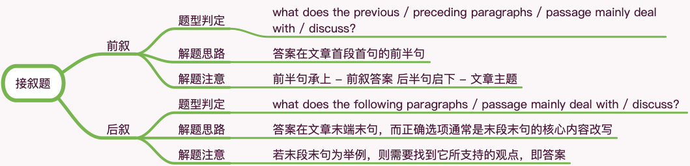

# 阅读题型归类之七接叙题

## 题型分类

前叙 · 后叙

## 前叙

### 题型判定

what does the **previous** / **preceding** paragraphs / passage mainly deal with / discuss?

### 解题思路

答案在文章首段首句的前半句

### 解题注意

前半句承上 - 前叙答案 后半句启下 - 文章主题

## 后叙

### 题型判定

what does the **following** paragraphs / passage mainly deal with / discuss?

### 解题思路

答案在文章末端末句，而正确选项通常是末段末句的核心内容改写

### 解题注意

若末段末句为举例，则需要找到它所支持的观点，即答案
