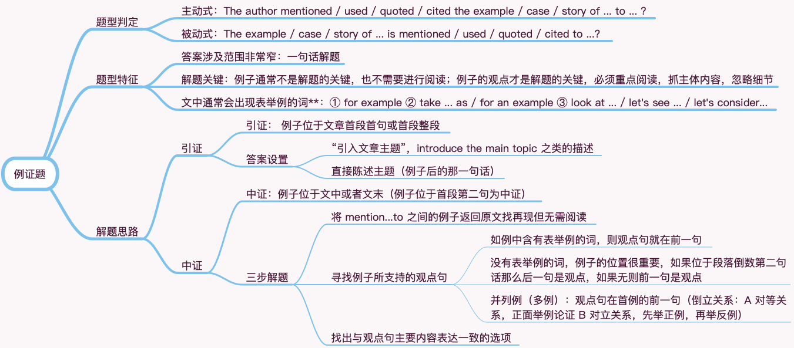

# 阅读题型归类之三 例证题

## 题型分类：引证 · 中证

## 题型判定

**主动式**：The author mentioned / used / quoted / cited the example / case / story of ... to ... ?

**被动式**：The example / case / story of ... is mentioned / used / quoted / cited to ...?

## 题型特征

**答案涉及范围非常窄**：一句话解题

**解题关键**：例子通常不是解题的关键，也不需要进行阅读；例子的观点才是解题的关键，必须重点阅读，抓主体内容，忽略细节

**文中通常会出现表举例的词**：① for example ② take ... as / for an example ③ look at ... / let's see ... / let's consider...

## 解题思路

### 引证

**引证**： 例子位于文章首段首句或首段整段

**答案设置**：

1 “引入文章主题”，introduce the main topic 之类的描述

2 直接陈述主题（例子后的那一句话）

### 中证

**中证**：例子位于文中或者文末（例子位于首段第二句为中证）

**三步解题**：

1 将 mention...to 之间的例子返回原文找再现但无需阅读

2 寻找例子所支持的观点句

① 如例中含有表举例的词，则观点句就在前一句

② 没有表举例的词，例子的位置很重要，如果位于段落倒数第二句话那么后一句是观点，如果无则前一句是观点

③ 并列例（多例）：观点句在首例的前一句（倒立关系：A 对等关系，正面举例论证 B 对立关系，先举正例，再举反例）

3 找出与观点句主要内容表达一致的选项
