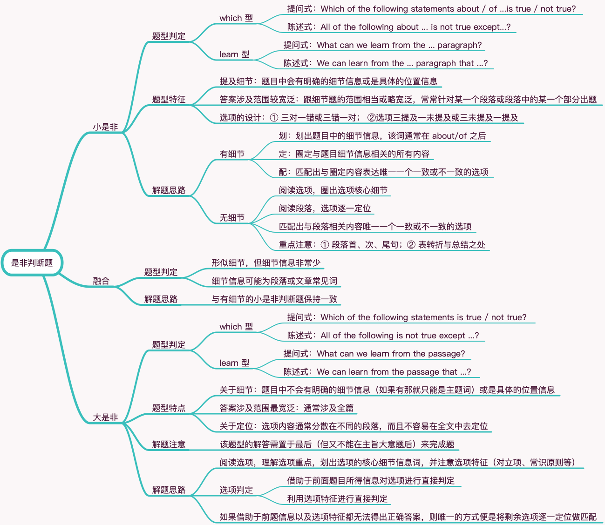

# 阅读题型归类之二 是非判断题

## 题型分类

小是非 · 融合 · 大是非

## 选项判定

TRUE：① 原文提及 ② 符合原文表达 ③ 符合作者态度 ④ 合主题

NOT TRUE: ① 原文未提及 ② 与原文有矛盾 ③ 与作者态度相反 ④ 偏离主题

## 小是非

### 题型判定

**which 型**：

提问式：Which of the following statements about / of ...is true / not true?

陈述式：All of the following about ... is not true except...?

**learn 型**：

提问式：What can we learn from the ... paragraph?

陈述式：We can learn from the ... paragraph that ...?

### 题型特征

**提及细节**：题目中会有明确的细节信息或是具体的位置信息

**答案涉及范围较宽泛**：跟细节题的范围相当或略宽泛，常常针对某一个段落或段落中的某一个部分出题

**选项的设计**：① 三对一错或三错一对； ②选项三提及一未提及或三未提及一提及

### 解题思路

1 有细节：三步解题

- 划：划出题目中的细节信息，该词通常在 about/of 之后
- 定：圈定与题目细节信息相关的所有内容
- 配：匹配出与圈定内容表达唯一一个一致或不一致的选项

2 无细节：三步解题

- 阅读选项，圈出选项核心细节
- 阅读段落，选项逐一定位
- 匹配出与段落相关内容唯一一个一致或不一致的选项

> 重点注意：① 段落首、次、尾句；② 表转折与总结之处

## 融合

### 题型判定

1 形似细节，但细节信息非常少

2 细节信息可能为段落或文章常见词

### 解题思路

与有细节的小是非判断题保持一致

## 大是非

### 题型判定

**which 型**：

提问式：Which of the following statements is true / not true?

陈述式：All of the following is not true except ...?

**learn 型**：

提问式：What can we learn from the passage?

陈述式：We can learn from the passage that ...?

### 题型特点

**关于细节**：题目中不会有明确的细节信息（如果有那就只能是主题词）或是具体的位置信息

**答案涉及范围最宽泛**：通常涉及全篇

**关于定位**：选项内容通常分散在不同的段落，而且不容易在全文中去定位

### 解题注意

该题型的解答需置于最后（但又不能在主旨大意题后）来完成题

### 解题思路

1 阅读选项，理解选项重点，划出选项的核心细节信息词，并注意选项特征（对立项、常识原则等）

2 选项判定：

- 借助于前面题目所得信息对选项进行直接判定
- 利用选项特征进行直接判定

3 如果借助于前题信息以及选项特征都无法得出正确答案，则唯一的方式便是将剩余选项逐一定位做匹配
