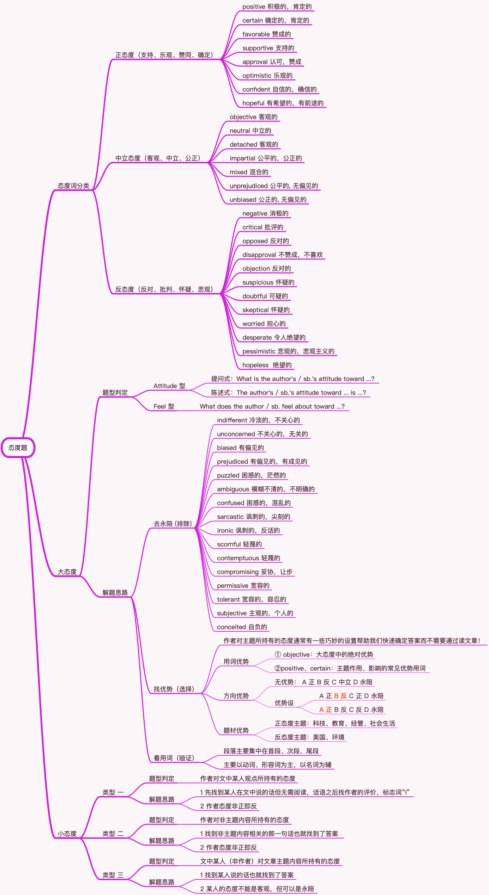

# 阅读题型归类之五 态度题

## 题型分类

大态度 · 小态度

## 态度词分类

### 正态度（支持、乐观、赞同、确定）

positive 积极的，肯定的

certain 确定的，肯定的

favorable 赞成的

supportive 支持的

approval 认可，赞成

optimistic 乐观的

confident 自信的，确信的

hopeful 有希望的，有前途的

### 中立态度（客观、中立、公正）

objective 客观的

neutral 中立的

detached 客观的

mixed 混合的

impartial 公平的，公正的

unbiased 公正的, 无偏见的

unprejudiced 公平的, 无偏见的

### 反态度（反对、批判、怀疑、悲观）

negative 消极的

critical 批评的

opposed 反对的

disapproval 不赞成，不喜欢

objection 反对的

suspicious 怀疑的

doubtful 可疑的

skeptical 怀疑的

worried 担心的

desperate 令人绝望的

pessimistic 悲观的，悲观主义的

hopeless  绝望的

## 大态度

### 题型判定

#### Attitude 型

**提问式**：

What is the author's / sb.'s attitude toward ...?

**陈述式**：

The author's / sb.'s attitude toward ... is ...?

#### Feel 型

What does the author / sb. feel about toward ...?

### 解题思路（三步解题）

1 去永陪 (排除)

indifferent 冷淡的，不关心的

unconcerned 不关心的，无关的

biased 有偏见的

prejudiced 有偏见的，有成见的

puzzled 困惑的，茫然的

ambiguous 模糊不清的，不明确的

confused 困惑的，混乱的

sarcastic 讽刺的，尖刻的

ironic 讽刺的，反话的

scornful 轻蔑的

contemptuous 轻蔑的

compromising 妥协，让步

permissive 宽容的

tolerant 宽容的，容忍的

subjective 主观的，个人的

conceited 自负的

2 找优势（选择）

作者对主题所持有的态度通常有一些巧妙的设置帮助我们快速确定答案而不需要通过读文章！

- 用词优势：① objective：大态度中的绝对优势 ②positive、certain：主题作用、影响的常见优势用词

- 方向优势：① 无优势： A 正 B 反 C 中立 D 永陪 ② 优势设：A 正 **B 反** C 正 D 永陪 | **A 正** B 反 C 反 D 永陪

- 主题优势：① 正态度主题：科技、教育、经管、社会生活 ② 反态度主题：美国、环境

3 看用词（验证）

- 段落主要集中在首段、次段、尾段
- 主要以动词、形容词为主，以名词为辅

## 小态度

### 类型 一

#### 题型判定

作者对文中某人观点所持有的态度

#### 解题思路

1 先找到某人在文中说的话但无需阅读，话语之后找作者的评价，标志词“I”

2 作者态度非正即反

### 类型 二

#### 题型判定

作者对非主题内容所持有的态度

#### 解题思路

1 找到非主题内容相关的那一句话也就找到了答案

2 作者态度非正即反

### 类型 三

#### 题型判定

文中某人（非作者）对文章主题内容所持有的态度

#### 解题思路

1 找到某人说的话也就找到了答案

2 某人的态度不能是客观，但可以是永陪
