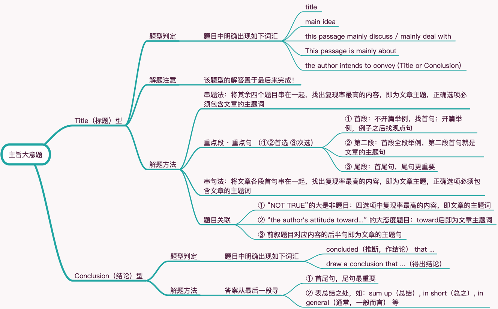

# 阅读题型归类之八主旨大意题

## 题型分类

Title（标题）型 · Conclusion（结论）型

## Title 型

### 题型判定

题目中明确出现如下词汇

- title

- main idea

- this passage mainly discuss / mainly deal with

- This passage is mainly about

- the author intends to convey (Title or Conclusion)

### 解题注意

该题型的解答置于最后来完成！

### 解题方法

1 串题法：将其余四个题目串在一起，找出复现率最高的内容，即为文章主题，正确选项必须包含文章的主题词

2 重点段 · 重点句 （*①②首选 ③次选*）

① 首段：不开篇举例，找首句；开篇举例，例子之后找观点句

② 第二段：首段全段举例，第二段首句就是文章的主题句

③ 尾段：首尾句，尾句更重要

3 串句法：将文章各段首句串在一起，找出复现率最高的内容，即为文章主题，正确选项必须包含文章的主题词

4 题目关联

① “NOT TRUE”的大是非题目：四选项中复现率最高的内容，即文章的主题词

② “the author's attitude toward...” 的大态度题目：toward后即为文章主题词

③ 前叙题目对应内容的后半句即为文章的主题句

## Conclusion 型

### 题型判定

题目中明确出现如下词汇

- concluded（推断，作结论） that ...

- draw a conclusion that ...（得出结论）

### 解题方法

答案从最后一段寻：① 首尾句，尾句最重要；② 表总结之处，如：sum up（总结）, in short（总之）, in general（通常，一般而言） 等
