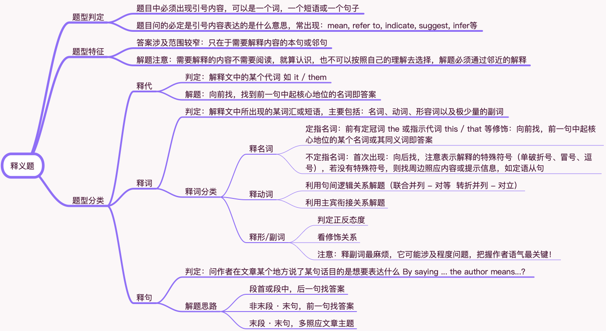

# 阅读题型归类之四 释义题

## 题型分类

释代 · 释词 · 释句

## 题型判定

1 题目中必须出现引号内容，可以是一个词，一个短语或一个句子

2 题目问的必定是引号内容表达的是什么意思，常出现：mean, refer to, indicate, suggest, infer等

## 题型特征

1 **答案涉及范围较窄**：只在于需要解释内容的本句或邻句

2 **解题注意**：需要解释的内容不需要阅读，就算认识，也不可以按照自己的理解去选择，解题必须通过邻近的解释

## 释代

**判定**：解释文中的某个代词 如 it / them

**解题**：向前找，找到前一句中起核心地位的名词即答案

## 释词

**判定**：解释文中所出现的某词汇或短语，主要包括：名词、动词、形容词以及极少量的副词

**释词分类**：释名词 · 释动词 · 释形/副词

### 释名词

A **定指名词**：前有定冠词 the 或指示代词 this / that 等修饰：向前找，前一句中起核心地位的某个名词或其同义词即答案

B **不定指名词**：首次出现：向后找，注意表示解释的特殊符号（单破折号、冒号、逗号），若没有特殊符号，则找周边照应内容或提示信息，如定语从句

### 释动词

A 利用句间逻辑关系解题（联合并列 - 对等  转折并列 - 对立）

B 利用主宾衔接关系解题

### 释形/副词

A 判定正反态度

B 看修饰关系

> 注意：释副词最麻烦，它可能涉及程度问题，把握作者语气最关键！

## 释句

**判定**：问作者在文章某个地方说了某句话目的是想要表达什么 By saying ... the author means...?

**解题思路**：

1 段首或段中，后一句找答案

2 非末段 · 末句，前一句找答案

3 末段 · 末句，多照应文章主题
