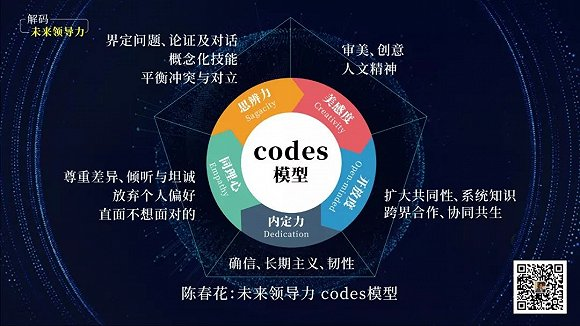
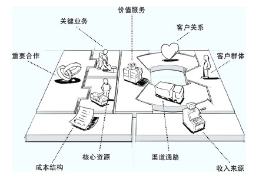
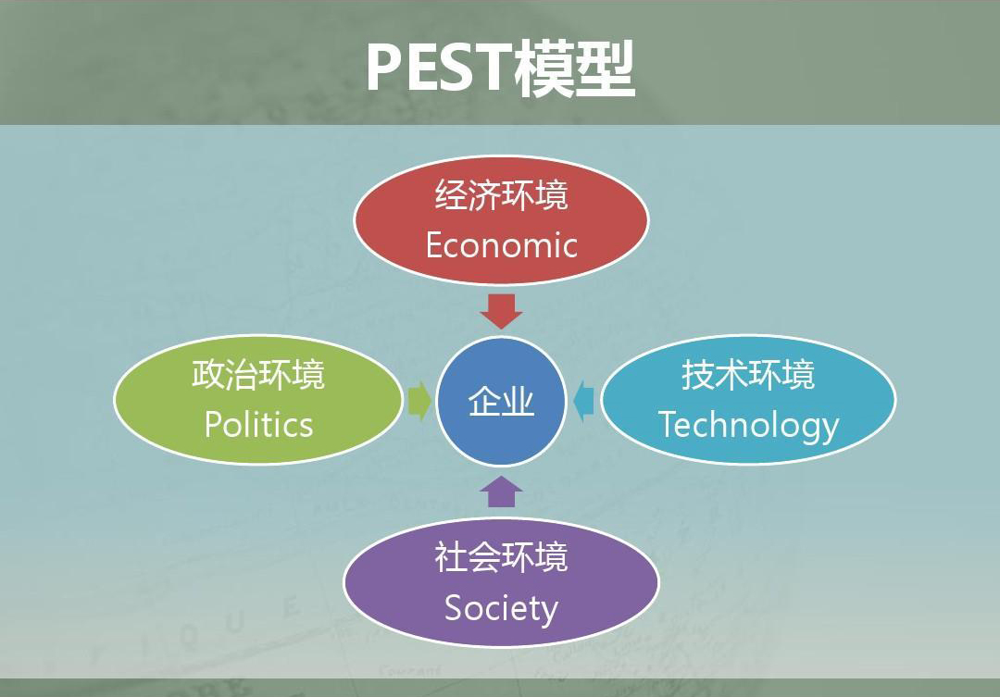

# 提前面试常见问题及选择策略

## MBA的理想对象

* 坚实而优秀的教育背景
* 符合或超出同龄人的职业经历
* 有成为未来商业精英所匹配的个人特质与职业发展的潜力
* 有优秀的分析能力和演讲表达能力
* 有明确的职业规划和管理潜质
* 有职业道德和较高的职业素养
* 让商学院认识到他们是你的首选或唯一选择

## MBA面试考官

### 经管学院教授

重点考生企业、职位等相关情况外，还主要来判断考生是否具备基本的管理知识以及在管理实践中是否有相应的应用

**特点**：

* 学术造诣深
* 管理实践少
* 行业方面了解窄
* 来自不同研究方向
* 侧重管理基本知识

### 企业高管校友

重点结合考生的职业背景考察考生的企业战略把握能力和规划能力; 把关本院MBA招􏰂标准和要求

**特点**：

* 丰富的企业管理经验
* 行业背景深入
* 理解本院MBA 定位和方向
* 社会和学校声誉的维护者
* 更客观公正的评价

**应对企业高管面试技巧**:

* 凸显管理经验和业绩
* 突出对行业的深入把握及对相关市场的前瞻性战略分析
* 展示科学的职业发展规划
* 不要刻意炫耀自己的管理职位和管理业绩
* 在面试中要适中体现出尊重考官的态度
* 耐心解答考官不熟悉的行业问题
* 谨慎对待行业内潜规则问题

### 企业人力资源总监

**特点**：

* 管理能力
* 分析和决策能力
* 战略全局观
* 灵活处理问题的能力
* 培养下属的能力
* 考生教育背景和个人兴趣

**应对企业人力资源总监的策略**：

* 充分体现管理者综合素质:管理能力、决策能力、组织协调能力
* 考生应当认真准备有关员工管理、员工激励方面的案例和实践体会
* 对于提出的压力面试问题，要表现沉着冷静有条理和逻辑性的表达出来

## MBA提面考生关注点

### 领导力的潜质

* 你可以不是领导，但是你 要展现出来你有成为领导的潜质
* 评价自己应对危机的能力，并给出理由和具体的实例
* 评价自己是否有勇气来面 对或者主导变革，并愿意 承担责任
* 评价自己影响、改变和说 服他人的能力

### 人生观、价值观和道德观

* 如何体现个人标签和共鸣点
* 人生观:人生观是人们在实践中形成的对于人生目的和意义的根本看法，它决定着人们实践活动的目标、人生道路的方向，也决定着人们行为选择的价值取向和对待生活的态度。
* 价值观:人认定事物、辩定是非的一种思维或取向，从而体现出人、事、物 一定的价值或作用
* 道德观:集中表现为个人处理与他人、集体和社会的关系的准则。人的道德 观都以个人利益在其行为中所占的地位为核心。

### 个人职业成就

* 所处公司组织架构的领导层级及职责划分
  * 考察重点: 组织规模，职位所属管理层级，升职空间，匹配工 作年限和未来发展。应重点侧重您对于组织战略目标的贡献。
* 任职工作经历，成就和优秀的事迹
  * 考察重点:可衡量，数据化，可比较，有相关性，有成果
* 个人独特经历或体现领导力的重要事件
  * 考察重点:体现个人领导力

### 职业规划和个人目标

考察重点:目标是否清晰，短期和长期的目标是否有相互关联性，层次是否清晰

职业规划的3大原则：愿景明确 计划可行 行为支持

**职业规划思考的方向**：

* 愿景目标:你的中短期(3-5年)和长期规划目标(6-10年)是 什么?
* 过去经历:你过去的职业发展历程如何体现你的规划是清晰的?
* 差距分析:目前情况与愿景目标的差距有哪些?
* 实施计划:你准备如何实施相关的计划?
* MBA支持:计划考的MBA项目如何能够帮助到你?
* 行为支撑:你的哪些行为可以支持你匹配你的计划?

### 逻辑思维和表达能力

* 逻辑顺畅合理
  * (关键假设法、寻找相关法、分类归纳法，指出不同法)
* 归纳思维能力(对当下或历史信息的分析)
  * 北京市每个月需要多少个一次性针管?
* 演绎思维(对未来的预测)
  * 一带一路对中国和世界意味着什么?会带来什么改变?
  * 贸易战对中国经济影响有多大?

### 言谈举止和行为

仪表举止  情绪控制  礼貌程度  自信程度

## 如何评价你自己

### 为何报考MBA

报考MBA的常见动机：**创业** **晋升** **充电** **转型**

### 个人标签品质

`沟通能力` `团队管理` `进取探索` `解决问题` `组织规划` `学习能力` `专业技能`

积极主动 用于承担 正直诚信 执行力强 承担压力 敢于冒险 以身作则 有大局观 信念坚定 适应变化

### 团队如何工作

`优秀的组织领导` `互补的成员类型` `共同的事业愿景` `清晰的团队目标` `合理的激励奖酬` `有效的沟通文化`

### 公司如何运营

* 价值主张:公司提供的产品和服务
* 客户关系:在每一个细分客户市场，建立和维护客户关系
* 渠道通路:公司如何沟通、接触客户而传递价值主张
* 关键合作:业务外包，或者从外部获得资源

### 行业竞争分析

**企业宏观环境的分析方法**：

> PEST分析是指宏观环境的分析，P是政治(politics)，E是经济(economy)，S是社会(society)，T是技术(technology)。在分析一个企业集团所处的背景的时候，通常是通过这四个因素来进行分析企业集团所面临的状况。

**内外部因素分析**：

## 个人简历撰写攻略

### 思考准备

* 列出你能力和素质清单
* 交际能力、组织能力、创造力、团队管理、领导能力、魄力、解决问题能力
* 管理才能、社交能力、人际关系、积极向上的性格、对待变化的态度
* 其他特长

### 简历撰写的PAR法则

* P(position)
  * 内容包括:陈述你的工作职责，包括你的职位、工作内容、上下级汇报关系、管辖 的人数与承担的工作责任
* A(action)
  * 内容包括:在你所涵盖的工作范围内，所有工作内容的详细陈述，具体到某一件事，让别人知道你的工作流程
* R(result)
  * 内容包括:你工作最后的结果是什么，有什么数字化的总结描述

* 把上面三项PAR的内容进行汇总和综合即你某一项工作的职责描述。

**参考示例**：

* P(position)
  * 担任销售部销售经理，负责业务员培训及部门管理、团队业绩达成
* A(action)
  * 制定部门全年销售及业绩达成方案，设计销售培训计划，对15名业务员进行销售技 能培训并进行业绩考􏰄，对市场进行准确调查，并对重点客户进行一对一回访，并 提供个性化服务，与业务代表深入沟通，协助市场推广部门调整产品推广模式
* R(result)
  * 比上年同期销售额提高8%，年度销售额提高15%
* PAR:
  * 编写全年业务达成方案，训练及管理团队15人业务团队，通过及时准确的市场调查 及重点客户反馈，与业务代表逐一深入沟通，调整产品推广模式，针对倾向性客户 提供个性化服务，在三个月内，销售额提高8%，年度销售额比上一年提高15%。

### 基本信息编写注意事项

* 所有基本信息前后要一致，比如公司名、职业经历、职位、下属人数等
* 培训经历代表了公司的格局和个人在公司的地位

### 工作履历/短文编写的STAR法则

描述一段工作履历时要“六有”

`具体化` `有比较` `有绩效` `有趋势` `有数字` `有展望`
  
## 个人自我介绍

1. 简洁介绍自己基本情况:姓名、年龄、毕业院校、专业等;
2. 所在行业情况:公司、岗位职责、工作以来取得的关键成就或是重要事迹;
3. 在过程中取得的能力收获这些成就说明的关键能力(最好能用别人的评价来 说明自己的优秀);
4. 这些成就和能力对于自己的理想和未来工作成就的重要性;
5. 陈述报考MBA的原因以及未来职业规划。
6. 特殊学习经历、工作经历、特长爱好等

## 申请短文常见高频问题回答技巧

### 作答前的几点思考

* 这个问题考察的是什么?
* 这个MBA项目更看重什么样的特质?
* 怎样和我的职业规划和现有工作联系在一起?
* 什么样的类似问题你有准备过?
* 撰写的套路是怎样的?

### 1、你为什么要读MBA?

1. 为什么要读MBA——因为职业规划 需要
2. 读MBA能给你带来什么——带着什么学习目的
3. 为何选择我们学校的MBA项目—— 培养目标和方向能达到自己的目标
4. 你能给我们学校带来什么——选择是相互的

* 你的短期和长期的职业规划是什么?

1. 你的职业规划以及MBA对实现规划的意义
2. 短期目标和长期目标一定要有强相关性
3. 对于目标已经有长期不懈的努力
4. 符合申请学校的培养目标
5. 职业目标不能过低，也不能过高
6. 不要依靠MBA转行、就业或者创业
7. 谨慎谈创业，尤其是不能因爱好而创业

**职业规划的3大原则**：

* 愿景明确：构建愿景，寻找支持， 包括知识/能力/人脉/平台/学历/组织
* 计划可行：计划一定要考虑内外 部的各种实际阻碍和制约
* 行为支持：报考MBA本身就是一 种行为，要选择能够实现愿景的行为支持

**可参考的职业规划写法**：

* 愿景目标:你的中短期(3-5年)和长期规划目标(6-10年)是 什么?
* 过去经历:你过去的职业发展历程如何体现你的规划是清晰的?
* 差距分析:目前情况与愿景目标的差距有哪些?
* 实施计划:你准备如何实施相关的计划?
* MBA支持:计划考的MBA项目如何能够帮助到你?
* 行为支撑:你的哪些行为可以支持你匹配你的计划?

### 2、列举出最能反映您的个人特质的词汇是什么?

* 用3个词来形容你自己
* 与MBA特质相符合的常见的词汇
  * 有领导力、高执行力、有条理、计划性强、创新力强、 诚实守信、逻辑严谨、有毅力、擅长表达、愿意分享
* 与MBA特性不够相符或者太宽泛的词汇
  * 为人友善、有追求、有潜力、幽默......

### 3、你职业生涯中最成功/最失败的一次经历是什么?

* 一定要跟工作相关
* 最好是近三年的经历
* 总分结构、条理清晰
* 描述事件的方法遵循STAR法则

### 4、你的职业生涯中遇到的困难和瓶颈是怎样面对和解决的?

* 困境:
  * 个人/团队遇到的困难
  * 对困难的分析，自己的决策，最终的结果
* 瓶颈:
  * 工作自身遇到瓶颈，分析，决策、结果
  * 个人能力遇到瓶颈后的分析、决策、结果

### 5、你曾经做过最疯狂/自我超越的事情是什么?

* 疯狂:
  * 可以理解为，别人做不到，你却做到了的事情;
  * 也可以理解为，别人认为不可能成功的事情，你却做成了。
* 自我超越的理解:
  * 它要求的是一个体现个人成长的经历。
  * 很明显，这个经历的重点是“超越”，所以不能简单写一个成功的经历，超越与成功 还是有明显区别的。
  * 超越，必然是自己认为不能、别人认为不可能、但最后能够做成的经历，要写这样的事情，才是符合要求的。
  * 建议选择能够体现自己职业晋升、职业转型的重大经历，效果会更好。
  * 自我超越的经历必然是成功的经历，但成功的经历未必是自我超越的经历。

### 6、请分享你对个人目前所在行业(或所关注行业)的一些思考?

* 行业目前现状是怎样的?
* 行业发展目前有什么瓶颈和潜在的问题?
* 你能做什么?
* 你准备如何应对?
* 行业的前景、红利和发展方向?
  
### 7、你认为自己什么地方与众不同?

> 与MBA诉求相关，彰显个人独特 气质，有普适性和稳定性

* 行业独特：VR、大数据、金融、媒体等
* 经历独特：留学经历、创业经历、公务员经历
* 职位独特：企业高管、人事总监、销售总监等
* 知识独特：国学、历史、国际文化
* 挫折独特：大起大落、等等

