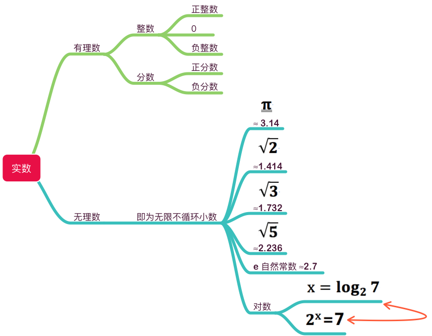
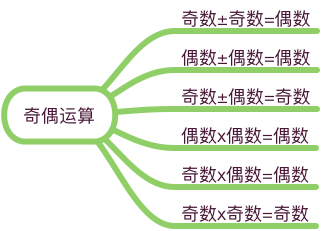
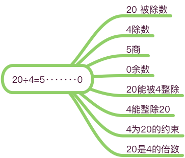
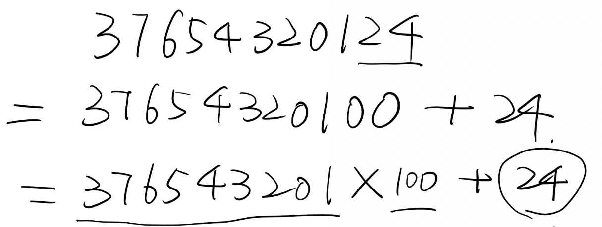
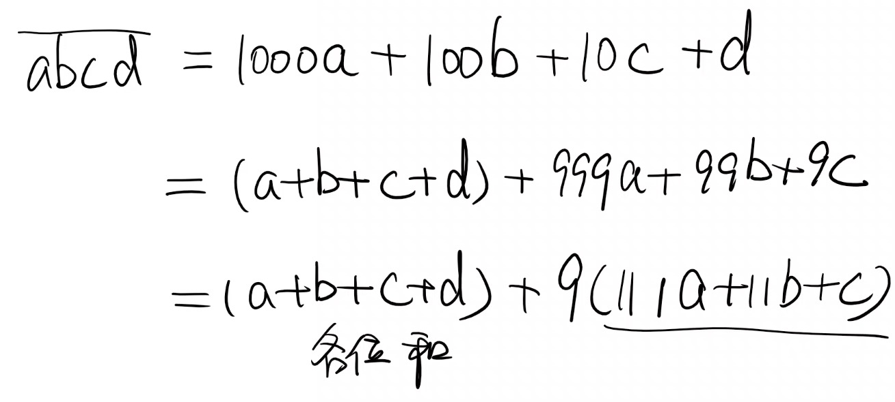
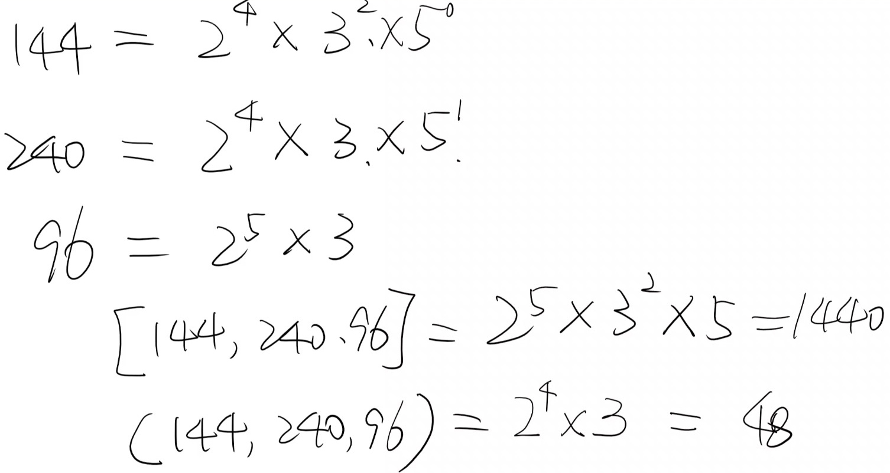
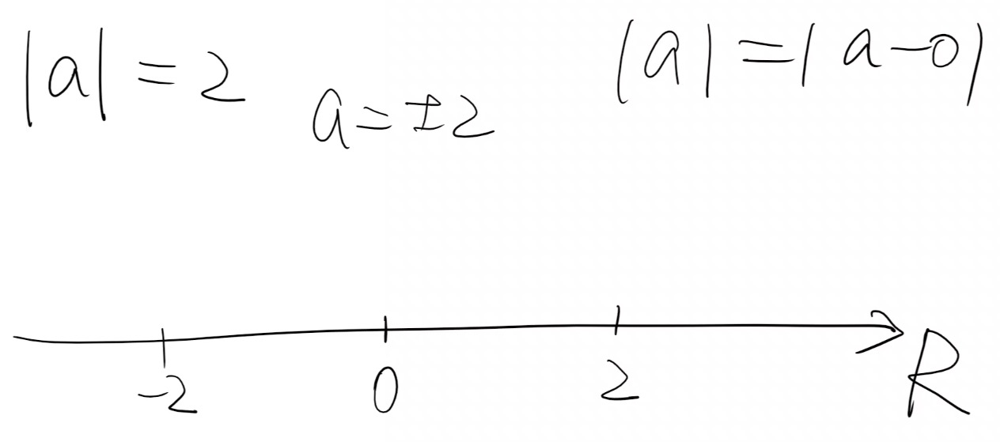
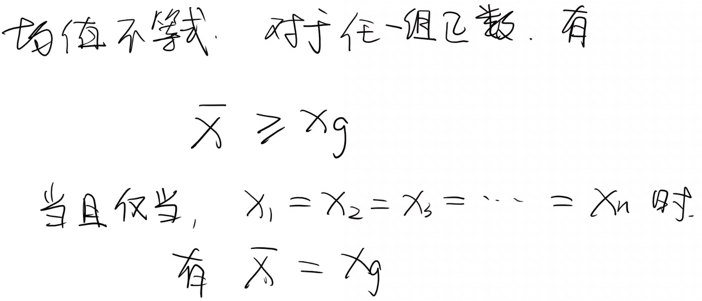
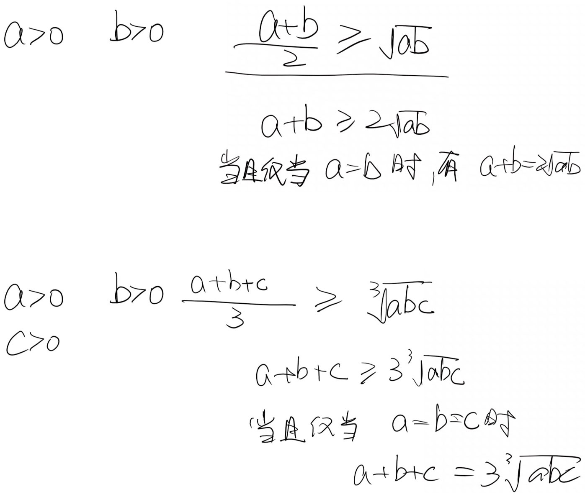

# 实数、绝对值、平均值

> 注：√ 表根号

## 实数的分类

## 奇数与偶数

* 奇数： 不能被2整除 n = 2k + 1
* 偶数：能被2整除，0属于偶数 n = 2k

## 数的整除

数的整除：当整数a除以非零整数b，商正好是整数而无余数时，则称a能被b整除或b能整除a

倍数，约数（因数）：当a能被b整除时，称a是b的倍数，b是a的约数

### 常见的整数特点

* 能被2整除的数：末尾（个位）0、2、4、6、8
* 能被3整数的数：各数位之和必能被3整除
* 能被4整除的数：末两位（个位和十位）数字必能被4整除
* 能被5整除的数：个位为0或5
* 能被6整除的数：同时满足能被2和3整除的条件
* 能被8整除的数：末三位数字必能被8整除
* 能被9整除的数：各数位数字之和必能被9整除
* 能被10整除的数：个位必为0
* 能被11整除的数：首尾相加等于中间数字(三位数推导 506=11x46)

**4和8整除数推导**：

**3和9整除数推导**：

### 例题

在1到100之间，能被9整除的整数的平均数是 （54）

思路：9，18，27 ··· 99 => 9x1, 9x2, 9x3 ··· 9x11 => 能被9整除的整数为11个 等差数列 平均数取中项

## 质数与合数

**质数**（或素数）：一个大于1的自然数（正整数），只有1和它本身两个因数（即只能被1和它本身整除）

如：2（唯一偶数）、3、5、7、11、13、17、19、23、29、31、37...

> 注：整数包括自然数，所以自然数一定是整数，且一定是非负整数。

合数：一个大于1的自然数，除了1和它本身两个因数外，还有其它因数

如：4、6、8、9、10、12...

> 0, 1不是质数也不是合数

### 例题

30030分解质因数：30030 = 2x3x5x7x11x13

---

设：a>b>c 原式=a-b+b-c+a-c=2a-2c=8 => a-c=4 => a、b、c 为 3、5、7 => a+b+c = 15

## 最小公倍数与最大公约数

> 任意正整数啊a、b，a和b相乘等于其最小公倍数乘最大公约数 => ab=[a, b]X(a, b)

**质因数分解法** （公倍数选指数大的，公约数选指数小的）

## 绝对值

正数的绝对值是它本身，负数的绝对是它的相反数，零的绝对值还是零。

### 几何意义

实数a的绝对值定义为：|a| (a, a≥0 -a, a<0) 其几何意义是一个实数a在数轴上所对应的点到原点的距离

### 非负性

|x| + y² + √z < - > x = 0, y = 0, z = 0

### 自比性

>1³ = 1   2³= 8  3³=27   4³=64  5³=125  6³=216

## 平均值

### 算数平均值

### 几何平均值

### 均值不等式

均值不等式两项和三项的使用：

